Wessex BESS Models
================

``` r
library(MASS)
library(raster)
library(sf)
library(tidyverse)
library(GGally)
library(broom)
library(MuMIn)
library(knitr)
library(hier.part)
library(patchwork)
library(corrr)
library(jtools)

# resolutions
rlns <- c("1km", "5km", "10km")

theme_set(theme_bw(base_size = 10) + theme(strip.background = element_blank(), 
                             panel.grid.major = element_blank(),
                             panel.grid.minor = element_blank()))

# get the functions I've written for variance partitioning negative binomial models
source("code/hier.part.nb.R")
```

Data collating
--------------

We're making one big dataframe of the response (Wessex BESS recreation visits) and covariates at each of the analysis resolutions.

Covariates are:

-   Proportion of agricultural land cover (clc\_agri; supply)
-   Proporiton of natural land covers (clc\_prop; supply)
-   Diversity of land-cover types (clc\_shei; supply)
-   Mean elevation (dem\_mean; supply)

``` r
get_df <- function(rln) {
  # list all files of specified resolution
  fnames <- list.files("data/covariates", pattern = paste0("_", rln), full.names = TRUE)
  rnames <-paste0("data/response/wbess_", rln, ".tif")
  
  # stack them
  dat <- stack(fnames)
  resp <- raster(rnames)
  dat <- crop(dat, resp)
  dat <- stack(dat, resp)
  # get into a dataframe
  df <- as.data.frame(dat, xy = TRUE) %>% 
    rename_all(funs(str_replace_all(., paste0("_", rln), ""))) %>% 
    na.omit %>% 
    mutate(resolution = rln)
  
  return(df)
}

# dataframe with obs for all data
df <- map_dfr(rlns, get_df) %>% 
  mutate(resolution = factor(resolution, 
                             levels = c("1km", 
                                        "5km", 
                                        "10km")),
         clc_prop = clc_amenity + clc_forest + clc_veg + clc_water + clc_wetland) %>% 
  select(x, y, resolution, wbess, clc_agri, clc_prop, clc_shei, dem_mean, dem_var, pop) %>% 
  as_tibble()
```

Data exploration
----------------

### Distribution, sample size and coverage of MENE data

First, let's just see whether there is sufficient variability and n in each resolution to fit models.

``` r
ggplot(df, aes(x = wbess)) + 
  geom_histogram() + 
  facet_wrap(~resolution, scales = "free", nrow = 1)
```

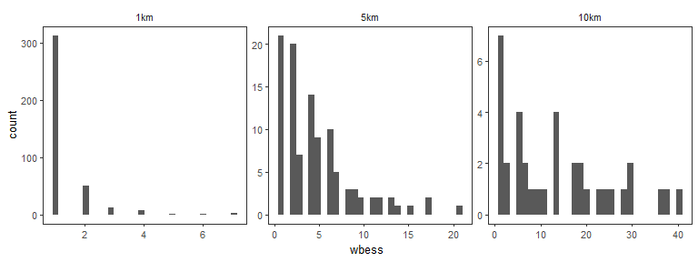

``` r
ggplot(df, aes(y = wbess)) + 
  geom_boxplot() + 
  facet_wrap(~resolution, scales = "free", nrow = 1)
```

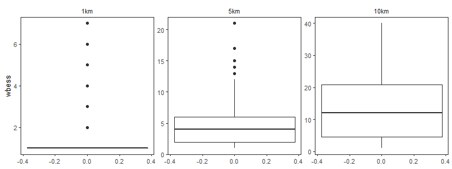

``` r
df %>% 
  group_by(resolution) %>% 
  summarise(count = n())
```

    ## # A tibble: 3 x 2
    ##   resolution count
    ##   <fct>      <int>
    ## 1 1km          387
    ## 2 5km          105
    ## 3 10km          36

1km may be problematic due to little variability, 10km may be problematic due to small n. Would like to add in a 2km resolution (which will need to happen across the board.

``` r
ggplot(df, aes(x = x, y = y)) + 
  geom_raster() + 
  coord_equal() + 
  facet_wrap(~resolution) + 
  theme(axis.title = element_blank(), 
        axis.text = element_blank(),
        axis.ticks = element_blank())
```

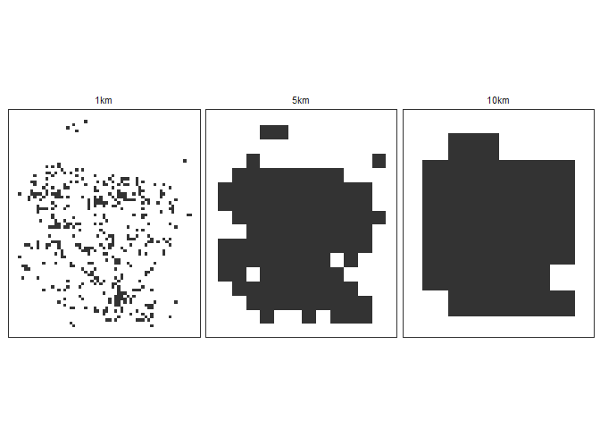

### Distribution of covariates

``` r
df_narrow <- df %>% 
  select(-x, -y, -wbess) %>% 
  gather(variable, value, -resolution) %>% 
  group_by(variable) %>% 
  nest() %>% 
  mutate(histograms = map2(variable, data, function(variable, data) {
    ggplot(data, aes(x = value)) + 
      geom_histogram() + 
      facet_wrap(~resolution, nrow = 1, scales = "free") +
      ggtitle(variable)
  }),
  boxplots = map2(variable, data, function(variable, data) {
    ggplot(data, aes(y = value)) + 
      geom_boxplot() + 
      facet_wrap(~resolution, nrow = 1, scales = "free") +
      ggtitle(variable)
  }))

df_narrow$histograms
```

    ## [[1]]

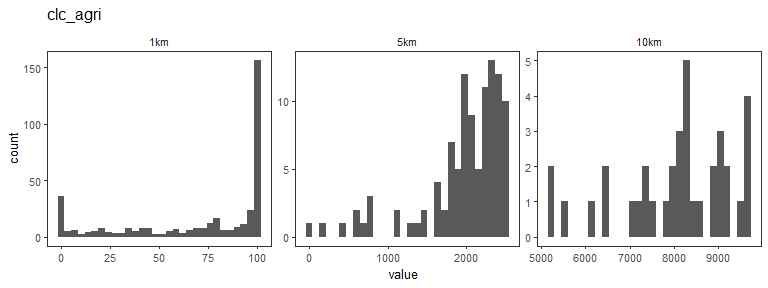

    ## 
    ## [[2]]

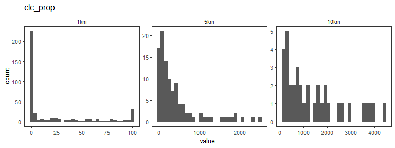

    ## 
    ## [[3]]

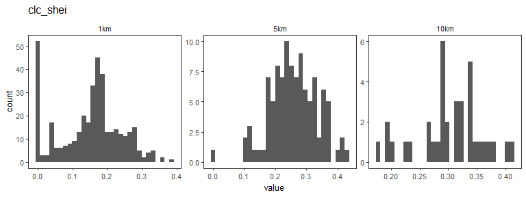

    ## 
    ## [[4]]


    ## 
    ## [[5]]

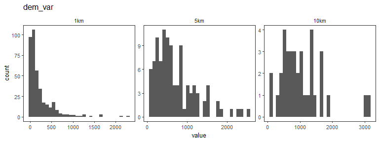

    ## 
    ## [[6]]

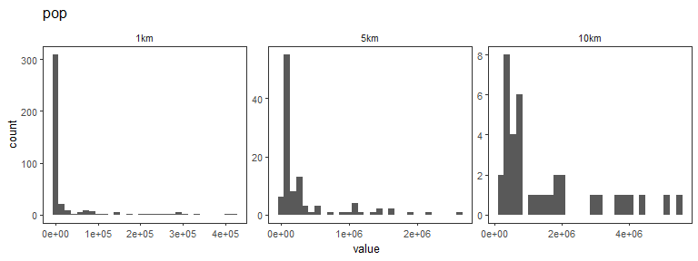

``` r
df_narrow$boxplots
```

    ## [[1]]

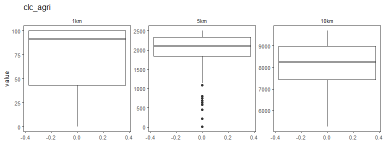

    ## 
    ## [[2]]

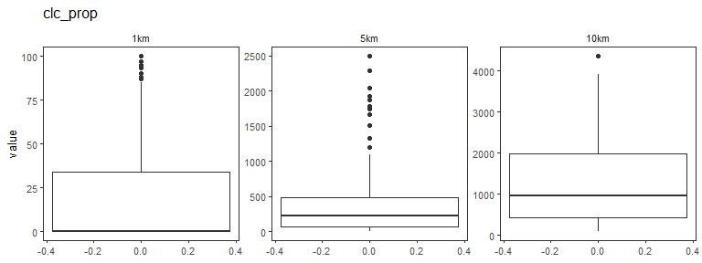

    ## 
    ## [[3]]

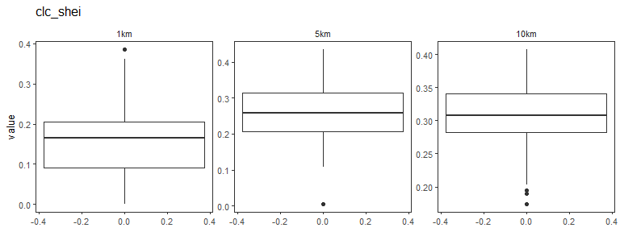

    ## 
    ## [[4]]

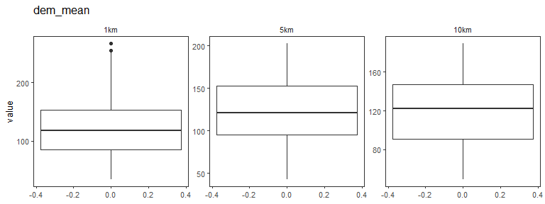

    ## 
    ## [[5]]

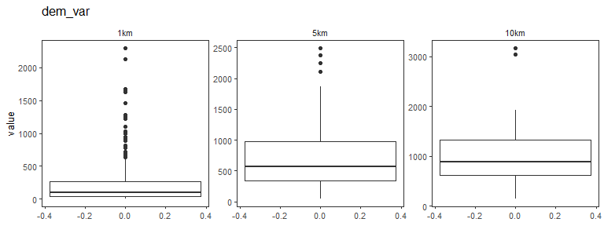

    ## 
    ## [[6]]

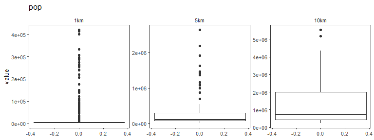

-   clc\_agri: left skew
-   clc\_prop: right skew
-   clc\_shei: fine
-   dem\_mean: fine
-   dem\_var: right skew
-   pop: right skew

### Data scaling and transformation

For now, I'm using the same transformations as the MENE study. Might revisit (in particular dem\_mean given there are no skew issues).

``` r
df_scaled <- df %>% group_by(resolution) %>% 
  nest() %>% 
  mutate(data = map(data, mutate_at, vars(clc_prop:pop), function(x) log(x + 1)),
         data = map(data, mutate, clc_agri = clc_agri^2),
         data_scale = map(data, mutate_at, vars(clc_agri:pop), function(x) scale(x) %>% as.vector)) 

df_analysis <- df_scaled %>% 
  select(resolution, data_scale) %>% 
  unnest()

# get mean and sd values from the log-transformed data (for back scaling)
means <- df_scaled %>% 
  select(resolution, data) %>% 
  unnest() %>% 
  group_by(resolution) %>% 
  summarise_all(funs(mean, sd)) %>% 
  gather(key, value, -resolution) 
```

### Correlation between variables

``` r
corrs <- df_analysis %>% 
  select(-x, -y) %>% 
  group_by(resolution) %>% 
  nest() %>% 
  mutate(
    corrs = map(data, function(x) {
      x %>% correlate(quiet = TRUE)
    }),
    corrs2 = map(corrs, function(x) {
      x %>% rearrange %>% shave
    })
  )

map(corrs$corrs2, rplot, shape = 15, print_cor = TRUE)
```

    ## [[1]]

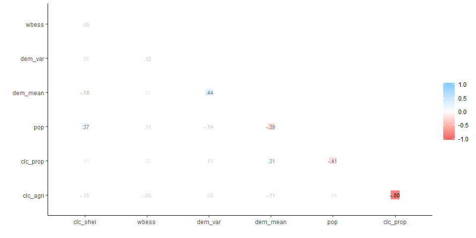

    ## 
    ## [[2]]

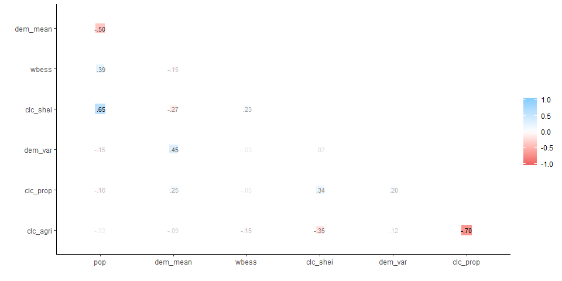

    ## 
    ## [[3]]

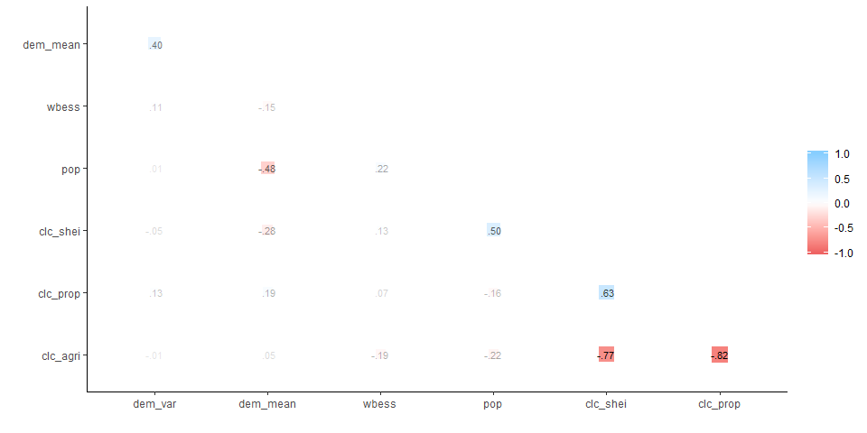

There are some high correlations here. Will likely cause issues for 10km analysis. Need to keep an eye on the estimates. Key one to watch out for is clc\_prop and clc\_agri.

And the relationship with WBESS data:

``` r
map(corrs$corrs, function(x) {
  x %>%
    focus(wbess) %>%
    mutate(rowname = reorder(rowname, wbess)) %>%
    ggplot(aes(rowname, wbess)) +
    geom_col() + 
    coord_flip() + 
    ylim(-1, 1)
})
```

    ## [[1]]

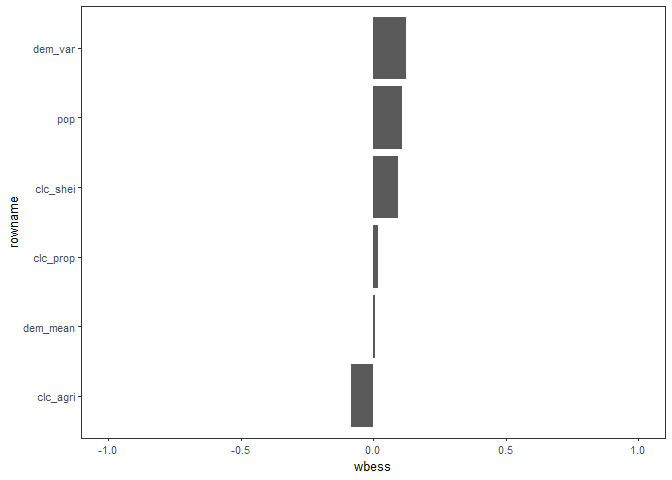

    ## 
    ## [[2]]

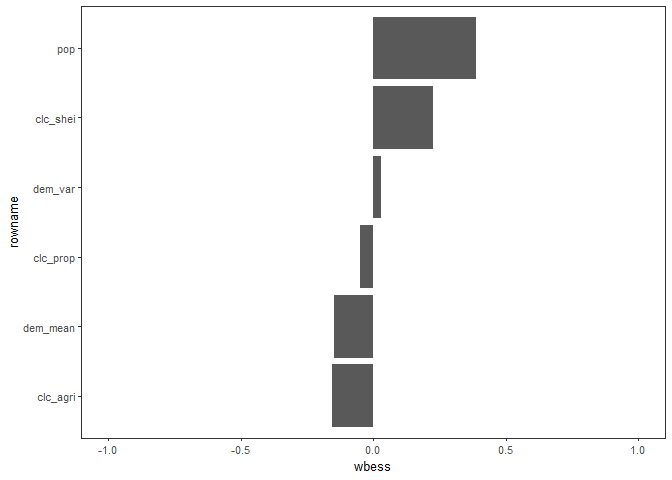

    ## 
    ## [[3]]

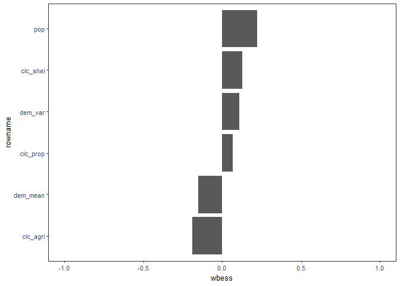

WBESS most strongly correlated with:

-   1km: Variation in elevation land-cover diversity and population (+ve); agriculture (-ve)
-   5km: Population and land-cover diversity (+ve); agriculture and mean elevation (-ve)
-   10km: Population, land-cover diversity and variation in elevation (+ve); agriculture and mean elevation (-ve)

NB all correlations are fairly weak and they are strongest at 5km resolution.

What are the shapes of the correlations between MENE and covariates:

``` r
df_analysis %>% 
  select(-x, -y) %>% 
  gather(variable, value, -resolution, -wbess) %>% 
  ggplot(aes(x = value, y = wbess)) + 
  geom_point() + 
  geom_smooth(method = "gam", formula = y ~ s(x, bs = "cs")) + 
  facet_grid(resolution ~ variable, scales = "free")
```

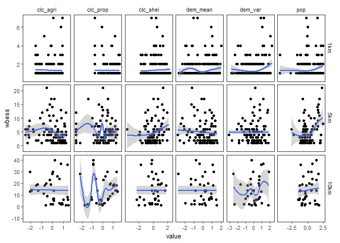

Statistical Models
------------------

We fit a Poisson glm for each resolution with proportion of agricultural land covers; proportion of natural land covers; diversity of land cover; mean elevation; variation in elevation (NB we do not include this in the MENE model, but it has a reasonable correlation with WBESS); and population as covariates.

We use variance partitioning to examing the relative importance of each predictor with the model.

We measure model fit using *D*<sup>2</sup>, which is equivalent to *R*<sup>2</sup> \[@Guisan2000a\]. Note also that due to the differences in sample size, *D*<sup>2</sup> values are not directly comparable.

``` r
fit_mod_full <- function(dat) {
  glm.nb(wbess ~ clc_agri + clc_prop + clc_shei + dem_mean + dem_var + pop,
      #family = "poisson",
      data = dat)
}

fit_mod_supply <- function(dat) {
  glm.nb(wbess ~ clc_agri + clc_prop + clc_shei + dem_mean + dem_var,
      #family = "poisson",
      data = dat)
}

fit_mod_demand <- function(dat) {
  glm.nb(wbess ~ pop,
      #family = "poisson",
      data = dat)
}

part_var <- function(dat) {
  resp <- dat %>% pull(wbess)
  pred <- dat %>% dplyr::select(clc_agri, clc_prop, clc_shei, dem_mean, pop)
  part <- hier.part(resp, pred, family = "poisson", gof = "logLik", barplot = FALSE)$I.perc
  out <- tibble(var = rownames(part), expl = part$I)
}


part_var_nb <- function(dat) {
  resp <- dat %>% pull(wbess)
  pred <- dat %>% dplyr::select(clc_agri, clc_prop, clc_shei, dem_mean, pop)
  part <- hier.part.nb(resp, pred, gof = "logLik")$I.perc
  out <- tibble(var = rownames(part), expl = part$I)
}

# get all of the required stats
get_mod_stats <- function(mod) {
  coeff <- coef(mod)[-1] %>% 
    data.frame %>% 
    as_tibble(rownames = "variable") %>% 
    rename(coef = 2)
  
  conf <- confint(mod)[-1,] %>% 
    data.frame %>% 
    as_tibble(rownames = "variable") %>% 
    rename(lci = X2.5.., uci = X97.5..)
  
  out <- inner_join(coeff, conf)
  
  return(out)
}

# and now the predicted values for plotting the relationships
get_preds <- function(mod, res) {
  vars <- variable.names(mod)[-1]
  map_dfr(vars, function(variable) {
    var_mean <- means %>% 
      filter(resolution == res, key == paste0(variable, "_mean")) %>% 
      pull(value)
    
    var_sd <- means %>% 
      filter(resolution == res, key == paste0(variable, "_sd")) %>% 
      pull(value)
    
    preds <- make_predictions(mod, pred = variable, interval = TRUE)$predicted %>% 
      select(wbess, pred = !!variable, ymin, ymax) %>% 
      mutate(pred = pred*var_sd + var_mean,
             pred = case_when(variable == "clc_agri" ~ sqrt(pred),
                              TRUE ~ exp(pred) - 1),
             variable = variable) %>% 
      na.omit()
    
    return(preds)
  })
}

mod <- df_analysis %>% 
  group_by(resolution) %>% 
  nest() %>% 
  mutate(mod_full = map(data, fit_mod_full),
         mod_supply = map(data, fit_mod_supply),
         mod_demand = map(data, fit_mod_demand),
         mod_glance = map(mod_full, glance),
         mod_stats = map(mod_full, get_mod_stats),
         mod_part = map(data, part_var_nb),
         mod_resid = map(mod_full, resid),
         mod_fitted = map(mod_full, function(x) x$fitted),
         mod_preds = map2(mod_full, resolution, get_preds))

mod_D2 <- mod %>%
  dplyr::select(resolution, mod_glance) %>% 
  unnest() %>% 
  mutate(D2 = (null.deviance - deviance)/null.deviance) %>% 
  dplyr::select(resolution, D2)

mod_part <- mod %>% 
  dplyr::select(resolution, mod_part) %>% 
  unnest()

mod_stats <- mod %>%
  dplyr::select(resolution, mod_stats) %>% 
  unnest()

mod %>%
  mutate(mod_full_aic = map_dbl(mod_full, function(x) x$aic),
         mod_demand_aic = map_dbl(mod_demand, function(x) x$aic),
         mod_supply_aic = map_dbl(mod_supply, function(x) x$aic)) %>% 
  select(resolution, mod_full_aic, mod_demand_aic, mod_supply_aic) %>% 
  kable()
```

| resolution |  mod\_full\_aic|  mod\_demand\_aic|  mod\_supply\_aic|
|:-----------|---------------:|-----------------:|-----------------:|
| 1km        |        966.1714|          962.1427|          964.6145|
| 5km        |        529.3984|          529.2066|          534.4163|
| 10km       |        273.9318|          267.3796|          272.9473|

At all resolutions, the demand model is best performing as judged by AIC. We still present the full model results for comparison against other data types.

### Model Fit

``` r
ggplot(mod_D2, aes(x = resolution, y = D2, group = 1)) + 
  geom_point() + 
  stat_summary(fun.y=sum, geom="line")
```

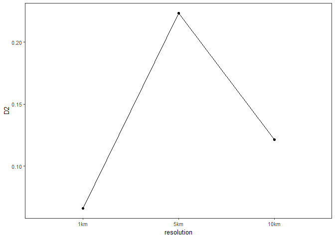

Explanatory power is best at 5km, poor at 1km and 10km.

### Variance partitioning

Using package `hier.part`

``` r
p1 <- ggplot(mod_D2, aes(x = resolution, y = D2)) + 
  geom_bar(stat = "identity") + 
  labs(x = "", y = expression(D^{2})) + 
  theme(axis.text.x = element_blank(),
        axis.ticks.x = element_blank())

p2 <- ggplot(mod_part, aes(x = resolution, y = expl, fill = var)) + 
  scale_fill_brewer(palette = "Set1", name = "Variable") + 
  geom_bar(stat = "identity", position = "stack") + 
  labs(x = "Resolution", y = "Variance explained %")

p1 + p2 + 
  plot_layout(ncol = 1, heights = c(1, 3)) + 
  plot_annotation(tag_levels = "a", tag_suffix = ")")
```

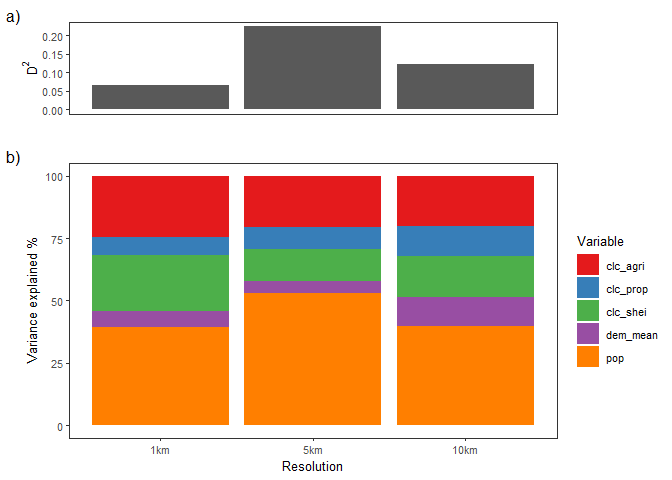

-   Reasonably stable across spatial resolutions. Importance of land-cover diversity greatst at 1km, this is replaced by increased importance of mean elevation and proportion of natural land covers at 10km.

### Variable relationships

``` r
mod_preds <- mod %>%
  select(resolution, mod_preds) %>% 
  unnest() %>% 
  group_by(resolution, variable) %>% 
  ungroup() %>% 
  group_by(resolution) %>% 
  nest() %>% 
  mutate(plots = map2(data, resolution, function(dat, res) {
    ggplot(dat, aes(x = pred, y = wbess)) +
      geom_line(aes()) + 
      geom_ribbon(aes(ymin = ymin, ymax = ymax), alpha = 0.2) +
      facet_wrap(~variable, nrow = 1, scale = "free_x") + 
      ggtitle(res)
  }))
  
mod_preds$plots[[1]] + mod_preds$plots[[2]] + mod_preds$plots[[3]] + plot_layout(ncol = 1)
```

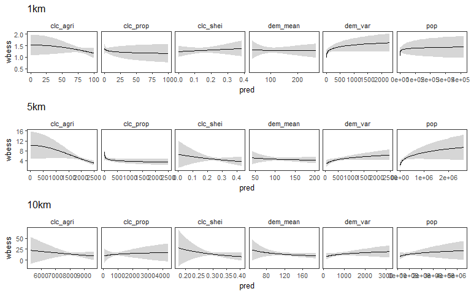

### Model checking

``` r
library(DHARMa)
for(i in 1:3) {
  print(mod$resolution[[i]])
  simulationOutput <- simulateResiduals(fittedModel = mod$mod_full[[i]], n = 250)
  par(mfrow=c(1,1))
  plot(simulationOutput)
  testDispersion(simulationOutput, alternative = "greater")
  par(mfrow=c(2, 3))
  plotResiduals(mod$data[[i]]$clc_agri, simulationOutput$scaledResiduals, xlab = "clc_agri")
  plotResiduals(mod$data[[i]]$clc_prop, simulationOutput$scaledResiduals, xlab = "clc_prop")
  plotResiduals(mod$data[[i]]$clc_shei, simulationOutput$scaledResiduals, xlab = "clc_shei")
  plotResiduals(mod$data[[i]]$dem_mean, simulationOutput$scaledResiduals, xlab = "dem_mean")
  plotResiduals(mod$data[[i]]$pop, simulationOutput$scaledResiduals, xlab = "pop")
}
```

    ## [1] 1km
    ## Levels: 1km 5km 10km

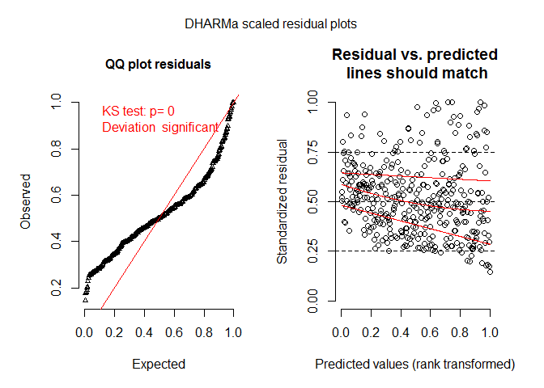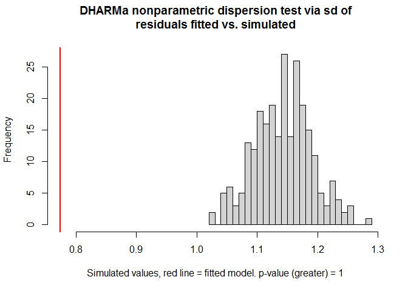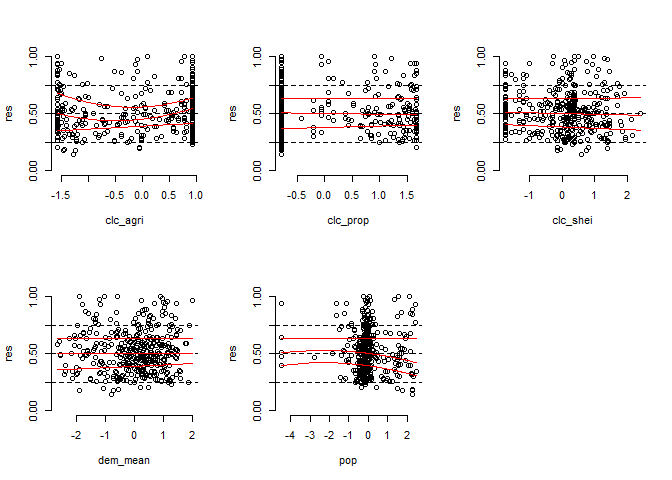

    ## [1] 5km
    ## Levels: 1km 5km 10km

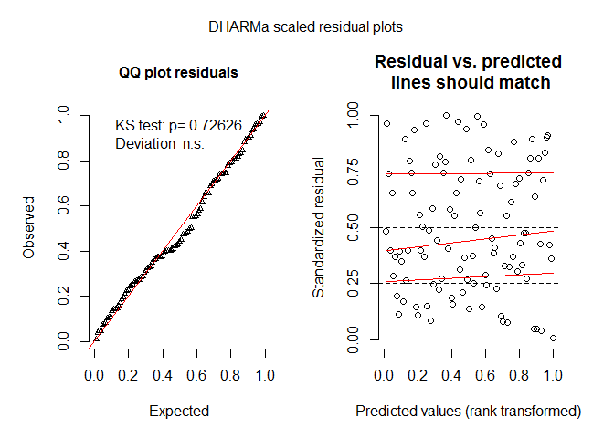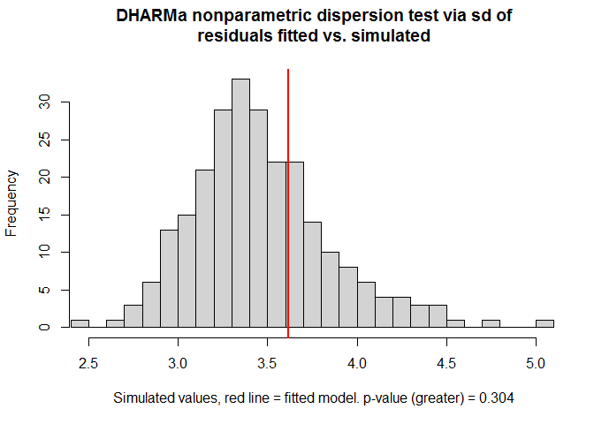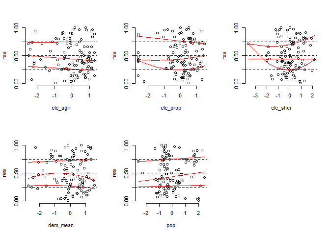

    ## [1] 10km
    ## Levels: 1km 5km 10km

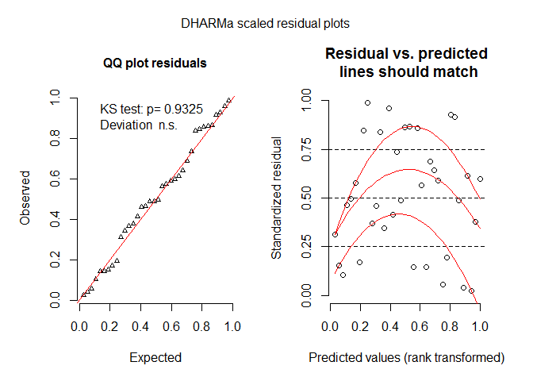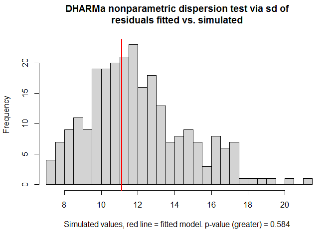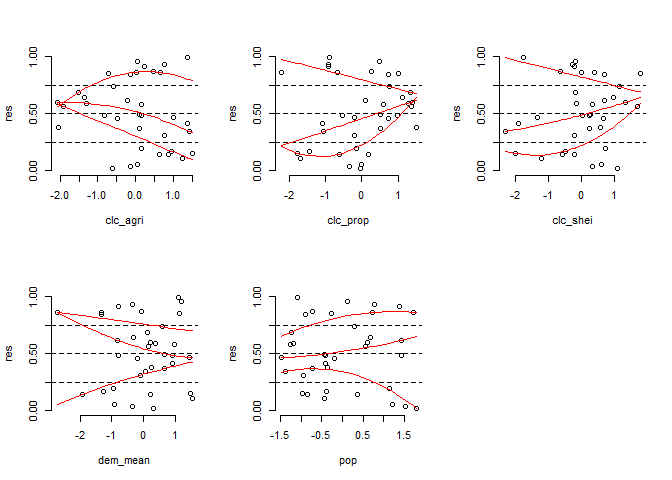

Model conforms to assumptions well for 5km resolution, 1km and 10km are poor.

Bright & dark spots
-------------------

Following Frei et al. \[-@Frei2018\] and Cinner et al. \[-@Cinner2016\], we calculate bright spots and dark spots. We define bright/dark spots as those where the observed value is +/- 1SD (of observed values) from the expected value.

``` r
bd_spots <- mod %>% 
  dplyr::select(resolution, data, mod_fitted, mod_resid) %>% 
  unnest() %>% 
  group_by(resolution) %>% 
  mutate(diff = mod_fitted - wbess,
         bd_spots = case_when(diff < -sd(wbess) ~ "Dark",
                               diff > sd(wbess) ~ "Bright",
                               TRUE ~ "Neutral"))

ggplot() + 
  geom_raster(data = bd_spots, 
              aes(x = x, y = y, fill = bd_spots)) + 
  facet_wrap(~resolution) + 
  scale_fill_manual(values = c("orange", "blue", "grey")) + 
  coord_equal() + 
  theme(axis.title = element_blank(), 
        axis.text = element_blank(),
        axis.ticks = element_blank())
```

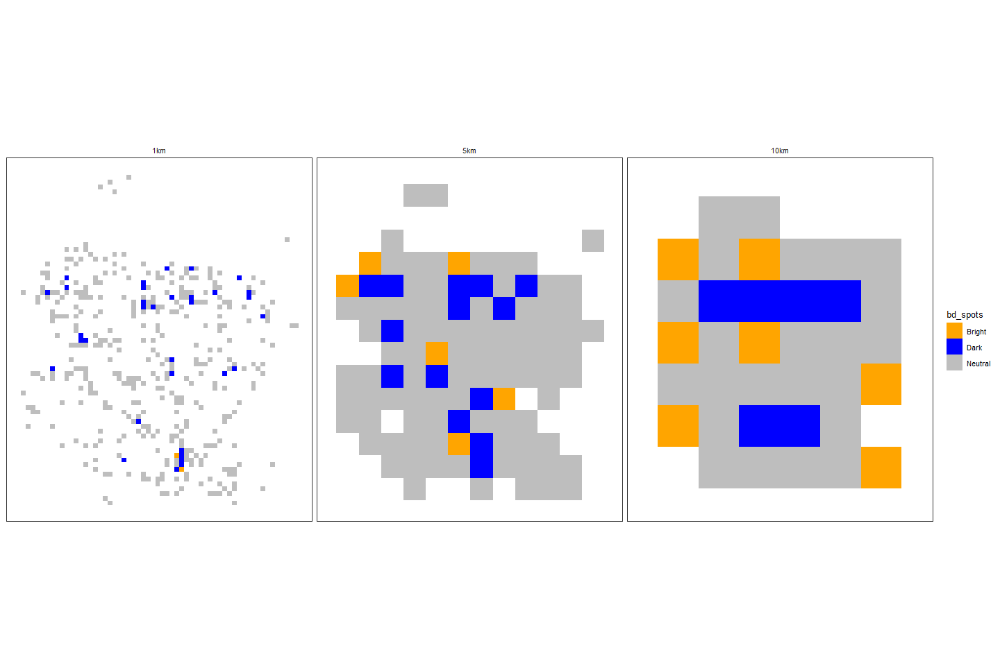

``` r
ggplot(bd_spots, aes(x = mod_fitted, y = wbess)) + 
  geom_point(aes(colour = bd_spots)) + 
  scale_colour_manual(values = c("orange", "blue", "grey")) + 
  geom_smooth(method = "lm") + 
  facet_wrap(~resolution, scales = "free")
```

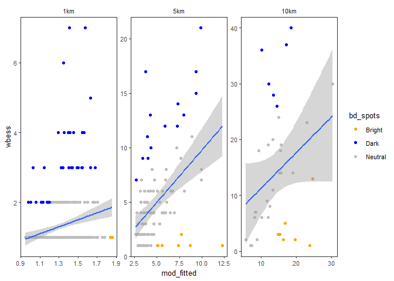

References
----------

Session Info
------------

``` r
session <- devtools::session_info()
session[[1]]
```

    ##  setting  value                       
    ##  version  R version 3.5.0 (2018-04-23)
    ##  system   x86_64, mingw32             
    ##  ui       RTerm                       
    ##  language (EN)                        
    ##  collate  English_United Kingdom.1252 
    ##  tz       Europe/London               
    ##  date     2018-09-17

``` r
session[[2]] %>% kable
```

| package      | \*  | version  | date       | source                                 |
|:-------------|:----|:---------|:-----------|:---------------------------------------|
| assertthat   |     | 0.2.0    | 2017-04-11 | CRAN (R 3.5.0)                         |
| backports    |     | 1.1.2    | 2017-12-13 | CRAN (R 3.5.0)                         |
| base         | \*  | 3.5.0    | 2018-04-23 | local                                  |
| bindr        |     | 0.1.1    | 2018-03-13 | CRAN (R 3.5.0)                         |
| bindrcpp     | \*  | 0.2.2    | 2018-03-29 | CRAN (R 3.5.0)                         |
| bitops       |     | 1.0-6    | 2013-08-17 | CRAN (R 3.5.0)                         |
| broom        | \*  | 0.4.4    | 2018-03-29 | CRAN (R 3.5.0)                         |
| caTools      |     | 1.17.1   | 2014-09-10 | CRAN (R 3.5.0)                         |
| cellranger   |     | 1.1.0    | 2016-07-27 | CRAN (R 3.5.0)                         |
| class        |     | 7.3-14   | 2015-08-30 | CRAN (R 3.5.0)                         |
| classInt     |     | 0.2-3    | 2018-04-16 | CRAN (R 3.5.0)                         |
| cli          |     | 1.0.0    | 2017-11-05 | CRAN (R 3.5.0)                         |
| cluster      |     | 2.0.7-1  | 2018-04-13 | CRAN (R 3.5.0)                         |
| codetools    |     | 0.2-15   | 2016-10-05 | CRAN (R 3.5.0)                         |
| colorspace   |     | 1.3-2    | 2016-12-14 | CRAN (R 3.5.0)                         |
| compiler     |     | 3.5.0    | 2018-04-23 | local                                  |
| corrr        | \*  | 0.3.0    | 2018-07-31 | CRAN (R 3.5.1)                         |
| crayon       |     | 1.3.4    | 2017-09-16 | CRAN (R 3.5.0)                         |
| datasets     | \*  | 3.5.0    | 2018-04-23 | local                                  |
| DBI          |     | 1.0.0    | 2018-05-02 | CRAN (R 3.5.0)                         |
| dendextend   |     | 1.8.0    | 2018-05-03 | CRAN (R 3.5.1)                         |
| DEoptimR     |     | 1.0-8    | 2016-11-19 | CRAN (R 3.5.0)                         |
| devtools     |     | 1.13.5   | 2018-02-18 | CRAN (R 3.5.0)                         |
| DHARMa       | \*  | 0.2.0    | 2018-06-05 | CRAN (R 3.5.1)                         |
| digest       |     | 0.6.15   | 2018-01-28 | CRAN (R 3.5.0)                         |
| diptest      |     | 0.75-7   | 2016-12-05 | CRAN (R 3.5.0)                         |
| dplyr        | \*  | 0.7.6    | 2018-06-29 | CRAN (R 3.5.1)                         |
| e1071        |     | 1.6-8    | 2017-02-02 | CRAN (R 3.5.0)                         |
| evaluate     |     | 0.10.1   | 2017-06-24 | CRAN (R 3.5.0)                         |
| flexmix      |     | 2.3-14   | 2017-04-28 | CRAN (R 3.5.1)                         |
| forcats      | \*  | 0.3.0    | 2018-02-19 | CRAN (R 3.5.0)                         |
| foreach      |     | 1.4.4    | 2017-12-12 | CRAN (R 3.5.0)                         |
| foreign      |     | 0.8-71   | 2018-07-20 | CRAN (R 3.5.1)                         |
| fpc          |     | 2.1-11.1 | 2018-07-20 | CRAN (R 3.5.1)                         |
| gap          |     | 1.1-21   | 2018-01-24 | CRAN (R 3.5.0)                         |
| gclus        |     | 1.3.1    | 2012-06-25 | CRAN (R 3.5.1)                         |
| gdata        |     | 2.18.0   | 2017-06-06 | CRAN (R 3.5.0)                         |
| GGally       | \*  | 1.4.0    | 2018-05-17 | CRAN (R 3.5.0)                         |
| ggplot2      | \*  | 3.0.0    | 2018-07-03 | CRAN (R 3.5.1)                         |
| glue         |     | 1.3.0    | 2018-07-17 | CRAN (R 3.5.1)                         |
| gplots       |     | 3.0.1    | 2016-03-30 | CRAN (R 3.5.1)                         |
| graphics     | \*  | 3.5.0    | 2018-04-23 | local                                  |
| grDevices    | \*  | 3.5.0    | 2018-04-23 | local                                  |
| grid         |     | 3.5.0    | 2018-04-23 | local                                  |
| gridExtra    |     | 2.3      | 2017-09-09 | CRAN (R 3.5.0)                         |
| gtable       |     | 0.2.0    | 2016-02-26 | CRAN (R 3.5.0)                         |
| gtools       | \*  | 3.5.0    | 2015-05-29 | CRAN (R 3.5.0)                         |
| haven        |     | 1.1.1    | 2018-01-18 | CRAN (R 3.5.0)                         |
| hier.part    | \*  | 1.0-4    | 2013-01-08 | CRAN (R 3.5.0)                         |
| highr        |     | 0.6      | 2016-05-09 | CRAN (R 3.5.0)                         |
| hms          |     | 0.4.2    | 2018-03-10 | CRAN (R 3.5.0)                         |
| htmltools    |     | 0.3.6    | 2017-04-28 | CRAN (R 3.5.0)                         |
| httr         |     | 1.3.1    | 2017-08-20 | CRAN (R 3.5.0)                         |
| iterators    |     | 1.0.9    | 2017-12-12 | CRAN (R 3.5.0)                         |
| jsonlite     |     | 1.5      | 2017-06-01 | CRAN (R 3.5.0)                         |
| jtools       | \*  | 1.0.0    | 2018-05-08 | CRAN (R 3.5.0)                         |
| kernlab      |     | 0.9-27   | 2018-08-10 | CRAN (R 3.5.1)                         |
| KernSmooth   |     | 2.23-15  | 2015-06-29 | CRAN (R 3.5.0)                         |
| knitr        | \*  | 1.20     | 2018-02-20 | CRAN (R 3.5.0)                         |
| labeling     |     | 0.3      | 2014-08-23 | CRAN (R 3.5.0)                         |
| lattice      |     | 0.20-35  | 2017-03-25 | CRAN (R 3.5.0)                         |
| lazyeval     |     | 0.2.1    | 2017-10-29 | CRAN (R 3.5.0)                         |
| lme4         |     | 1.1-17   | 2018-04-03 | CRAN (R 3.5.0)                         |
| lubridate    |     | 1.7.4    | 2018-04-11 | CRAN (R 3.5.0)                         |
| magrittr     |     | 1.5      | 2014-11-22 | CRAN (R 3.5.0)                         |
| MASS         | \*  | 7.3-49   | 2018-02-23 | CRAN (R 3.5.0)                         |
| Matrix       |     | 1.2-14   | 2018-04-13 | CRAN (R 3.5.0)                         |
| mclust       |     | 5.4      | 2017-11-22 | CRAN (R 3.5.0)                         |
| memoise      |     | 1.1.0    | 2017-04-21 | CRAN (R 3.5.0)                         |
| methods      | \*  | 3.5.0    | 2018-04-23 | local                                  |
| mgcv         |     | 1.8-23   | 2018-01-21 | CRAN (R 3.5.0)                         |
| minqa        |     | 1.2.4    | 2014-10-09 | CRAN (R 3.5.0)                         |
| mnormt       |     | 1.5-5    | 2016-10-15 | CRAN (R 3.5.0)                         |
| modelr       |     | 0.1.2    | 2018-05-11 | CRAN (R 3.5.0)                         |
| modeltools   |     | 0.2-22   | 2018-07-16 | CRAN (R 3.5.1)                         |
| MuMIn        | \*  | 1.40.4   | 2018-01-30 | CRAN (R 3.5.0)                         |
| munsell      |     | 0.4.3    | 2016-02-13 | CRAN (R 3.5.0)                         |
| mvtnorm      |     | 1.0-7    | 2018-01-25 | CRAN (R 3.5.0)                         |
| nlme         |     | 3.1-137  | 2018-04-07 | CRAN (R 3.5.0)                         |
| nloptr       |     | 1.0.4    | 2017-08-22 | CRAN (R 3.5.0)                         |
| nnet         |     | 7.3-12   | 2016-02-02 | CRAN (R 3.5.1)                         |
| parallel     |     | 3.5.0    | 2018-04-23 | local                                  |
| patchwork    | \*  | 0.0.1    | 2018-07-20 | Github (<thomasp85/patchwork@7fb35b1>) |
| pillar       |     | 1.2.2    | 2018-04-26 | CRAN (R 3.5.0)                         |
| pkgconfig    |     | 2.0.1    | 2017-03-21 | CRAN (R 3.5.0)                         |
| plyr         |     | 1.8.4    | 2016-06-08 | CRAN (R 3.5.0)                         |
| prabclus     |     | 2.2-6    | 2015-01-14 | CRAN (R 3.5.1)                         |
| psych        |     | 1.8.4    | 2018-05-06 | CRAN (R 3.5.0)                         |
| purrr        | \*  | 0.2.5    | 2018-05-29 | CRAN (R 3.5.1)                         |
| qrnn         |     | 2.0.2    | 2017-12-20 | CRAN (R 3.5.0)                         |
| R6           |     | 2.2.2    | 2017-06-17 | CRAN (R 3.5.0)                         |
| raster       | \*  | 2.6-7    | 2017-11-13 | CRAN (R 3.5.1)                         |
| RColorBrewer |     | 1.1-2    | 2014-12-07 | CRAN (R 3.5.0)                         |
| Rcpp         |     | 0.12.18  | 2018-07-23 | CRAN (R 3.5.1)                         |
| readr        | \*  | 1.1.1    | 2017-05-16 | CRAN (R 3.5.0)                         |
| readxl       |     | 1.1.0    | 2018-04-20 | CRAN (R 3.5.0)                         |
| registry     |     | 0.5      | 2017-12-03 | CRAN (R 3.5.0)                         |
| reshape      |     | 0.8.7    | 2017-08-06 | CRAN (R 3.5.0)                         |
| reshape2     |     | 1.4.3    | 2017-12-11 | CRAN (R 3.5.0)                         |
| rgdal        |     | 1.3-4    | 2018-08-03 | CRAN (R 3.5.1)                         |
| rlang        |     | 0.2.1    | 2018-05-30 | CRAN (R 3.5.1)                         |
| rmarkdown    |     | 1.10     | 2018-06-11 | CRAN (R 3.5.0)                         |
| robustbase   |     | 0.93-2   | 2018-07-27 | CRAN (R 3.5.1)                         |
| rprojroot    |     | 1.3-2    | 2018-01-03 | CRAN (R 3.5.0)                         |
| rstudioapi   |     | 0.7      | 2017-09-07 | CRAN (R 3.5.0)                         |
| rvest        |     | 0.3.2    | 2016-06-17 | CRAN (R 3.5.0)                         |
| scales       |     | 0.5.0    | 2017-08-24 | CRAN (R 3.5.0)                         |
| seriation    |     | 1.2-3    | 2018-02-05 | CRAN (R 3.5.1)                         |
| sf           | \*  | 0.6-3    | 2018-05-17 | CRAN (R 3.5.1)                         |
| sp           | \*  | 1.2-7    | 2018-01-19 | CRAN (R 3.5.0)                         |
| spData       |     | 0.2.8.3  | 2018-03-25 | CRAN (R 3.5.0)                         |
| splines      |     | 3.5.0    | 2018-04-23 | local                                  |
| stats        | \*  | 3.5.0    | 2018-04-23 | local                                  |
| stats4       |     | 3.5.0    | 2018-04-23 | local                                  |
| stringi      |     | 1.1.7    | 2018-03-12 | CRAN (R 3.5.0)                         |
| stringr      | \*  | 1.3.1    | 2018-05-10 | CRAN (R 3.5.0)                         |
| tibble       | \*  | 1.4.2    | 2018-01-22 | CRAN (R 3.5.0)                         |
| tidyr        | \*  | 0.8.0    | 2018-01-29 | CRAN (R 3.5.0)                         |
| tidyselect   |     | 0.2.4    | 2018-02-26 | CRAN (R 3.5.0)                         |
| tidyverse    | \*  | 1.2.1    | 2017-11-14 | CRAN (R 3.5.0)                         |
| tools        |     | 3.5.0    | 2018-04-23 | local                                  |
| trimcluster  |     | 0.1-2.1  | 2018-07-20 | CRAN (R 3.5.1)                         |
| TSP          |     | 1.1-6    | 2018-04-30 | CRAN (R 3.5.1)                         |
| udunits2     |     | 0.13     | 2016-11-17 | CRAN (R 3.5.0)                         |
| units        |     | 0.5-1    | 2018-01-08 | CRAN (R 3.5.0)                         |
| utf8         |     | 1.1.3    | 2018-01-03 | CRAN (R 3.5.0)                         |
| utils        | \*  | 3.5.0    | 2018-04-23 | local                                  |
| viridis      |     | 0.5.1    | 2018-03-29 | CRAN (R 3.5.0)                         |
| viridisLite  |     | 0.3.0    | 2018-02-01 | CRAN (R 3.5.0)                         |
| whisker      |     | 0.3-2    | 2013-04-28 | CRAN (R 3.5.0)                         |
| withr        |     | 2.1.2    | 2018-07-20 | Github (<jimhester/withr@fe56f20>)     |
| xml2         |     | 1.2.0    | 2018-01-24 | CRAN (R 3.5.0)                         |
| yaml         |     | 2.1.19   | 2018-05-01 | CRAN (R 3.5.0)                         |
