MENE Models
================

``` r
library(MASS)
library(raster)
library(sf)
library(tidyverse)
library(GGally)
library(broom)
library(MuMIn)
library(knitr)

# resolutions
rlns <- c("1km", "5km", "10km", "25km", "50km", "100km")

# study extent (for MENE this is England)
study_ext_sf <- st_read("~/DATA/ADMINISTRATIVE/gb_shapefile/GBR_adm1.shp", quiet = TRUE) %>% 
  filter(NAME_1 == "England") %>% 
  st_transform(crs = 3035)

study_ext <- as(study_ext_sf, "Spatial")
```

Data collating
--------------

We're making one big dataframe of the response (MENE visits) and covariates (landcover diversity, topographical variation and population density) at each of the analysis resolutions.

``` r
get_df <- function(rln) {
  # list all files of specified resolution
  fnames <- list.files("data", pattern = paste0("_", rln), full.names = TRUE)
  
  # stack them
  dat <- stack(fnames)
  
  # crop by study extent
  dat <- crop(dat, study_ext)
  
  # get into a dataframe
  df <- as.data.frame(dat, xy = TRUE) %>% 
    rename_all(funs(str_replace_all(., paste0("_", rln), ""))) %>% 
    na.omit %>% 
    mutate(resolution = rln)
  
  return(df)
}

# dataframe with obs for all data
df <- map_dfr(rlns, get_df) %>% 
  mutate(resolution = factor(resolution, 
                             levels = c("1km", 
                                        "5km", 
                                        "10km", 
                                        "25km", 
                                        "50km", 
                                        "100km")))
```

Data exploration
----------------

First, let's just see whether there is sufficient variability and n in each resolution to fit models.

``` r
ggplot(df, aes(x = mene)) + 
  geom_histogram() + 
  facet_wrap(~resolution, scales = "free")
```

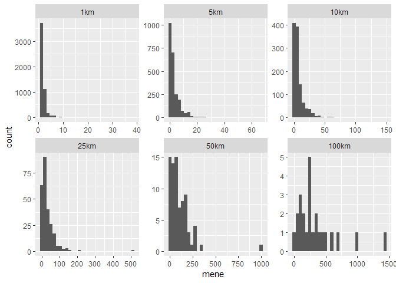

``` r
df %>% 
  group_by(resolution) %>% 
  summarise(count = n())
```

    ## # A tibble: 6 x 2
    ##   resolution count
    ##   <fct>      <int>
    ## 1 1km         5153
    ## 2 5km         2373
    ## 3 10km        1120
    ## 4 25km         254
    ## 5 50km          78
    ## 6 100km         24

Based on the distributions, we can fit models for all resolutions, but for the larger two (50km and 100km), n is very small.

We can also inspect the spatial coverage of the MENE data.

``` r
ggplot(df, aes(x = x, y = y)) + 
  geom_raster() + 
  coord_equal() + 
  facet_wrap(~resolution) + 
  theme(axis.title = element_blank(), 
        axis.text = element_blank(),
        axis.ticks = element_blank())
```

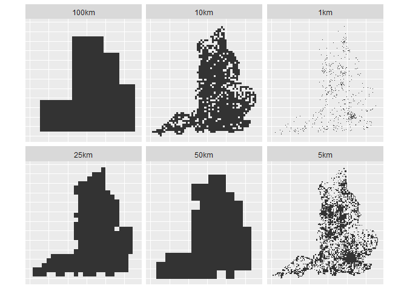

Sparse coverage at 1km and 5km, but not too geographically biased. There are a lot of records around London, and to some extent within National Parks. This may cause some issues, but will see.

Finally, lets look at the relationships between variables:

``` r
p <- list()
for(r in rlns) {
  p[[r]] <- ggpairs(df %>% filter(resolution == r) %>% select(-resolution, -x, -y), progress = FALSE)
}

p
```

    ## $`1km`

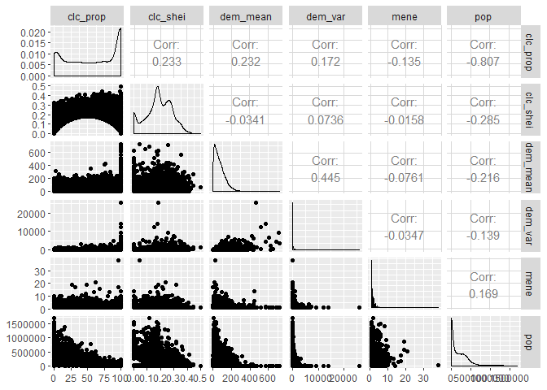

    ## 
    ## $`5km`


    ## 
    ## $`10km`

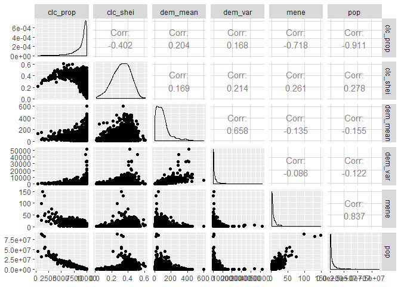

    ## 
    ## $`25km`

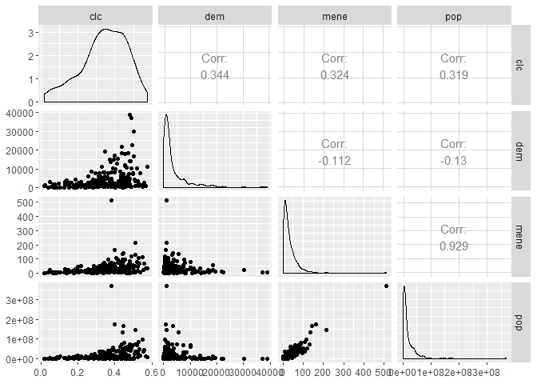

    ## 
    ## $`50km`

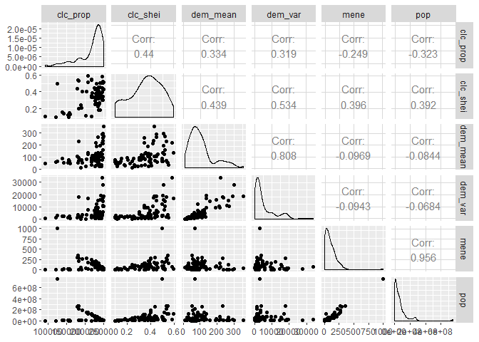

    ## 
    ## $`100km`

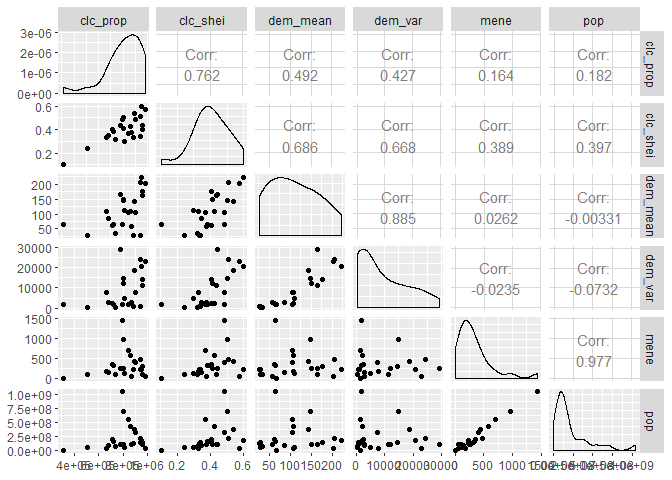

Seems that it's population and proportion of non-built land covers that are the strongest predictor at all resolutions, and that this effect increases with spatial resolution. LC diversity is next, with similar effect. Note that population density and proportion of non-built land covers are highly correlated at all resolutions except for 50km and 100km.

Statistical Models
------------------

We will fit negative binomial GLMs (due to overdispersion) with proportion of non-built land cover (clc\_prop), mean elevation (dem\_mean) and population (pop) and their first-order interactions as the full model.

``` r
fit_mod <- function(dat) {
  glm(mene ~ clc_prop * dem_mean + clc_prop * pop + dem_mean * pop,
      family = "poisson",
      data = dat)
}

scale_cols <- function(x) {
  scale_this <- function(y) as.vector(scale(y))
  x <- x %>% mutate(pop = log(pop + 1))
  mutate_at(x, .vars = vars(-mene), .funs = funs(scale_this))
}

# get the CA function
source("../upscaling/R/ca_glm.R")

# get all of the required stats
get_mod_stats <- function(mod) {
  coeff <- coef(mod)[-1] %>% 
    data.frame %>% 
    as_tibble(rownames = "variable") %>% 
    rename(coef = 2)
  
  conf <- confint(mod)[-1,] %>% 
    data.frame %>% 
    as_tibble(rownames = "variable") %>% 
    rename(lci = X2.5.., uci = X97.5..)

  ca <- calc_commonality(mod)$CCTotalbyVar %>% 
    as_tibble(rownames = "variable")
  
  out <- inner_join(coeff, conf) %>% 
    inner_join(ca)

  return(out)
}

mod <- df %>% 
  group_by(resolution) %>% 
  nest() %>% 
  mutate(data_scaled = map(data, scale_cols),
         mod = map(data_scaled, fit_mod),
         mod_glance = map(mod, glance),
         mod_stats = map(mod, get_mod_stats),
         mod_resid = map(mod, resid),
         mod_fitted = map(mod, fitted))

mod_D2 <- mod %>%
  select(resolution, mod_glance) %>% 
  unnest() %>% 
  mutate(D2 = (null.deviance - deviance)/null.deviance) %>% 
  select(resolution, D2)

mod_stats <- mod %>% 
  select(resolution, mod_stats) %>% 
  unnest() %>% 
  inner_join(mod_D2)
```

TODO: Testing residuals with DHARMa showed overdispersion with strong patterns in the residuals for CLC and POP. Would be worth fitting a quadratic term for each of these. Even with population logged, there are some low population cells (even at 100km level) with high residual values.

How well do they fit? NB We are using *D*<sup>2</sup>, which is equivalent to *R*<sup>2</sup> (Guisan and Zimmermann 2000). Note also that due to the differences in sample size, *D*<sup>2</sup> values are not directly comparable.

``` r
ggplot(mod_D2, aes(x = resolution, y = D2, group = 1)) + 
  geom_point() + 
  stat_summary(fun.y=sum, geom="line")
```

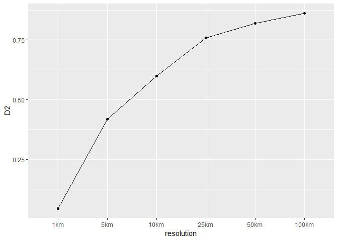

Explanatory power of the model increases greatly between 1km and 5km resolutions (with increasing explanatory power as resolution increases, as to be expected). Might be best to drop the 1km model.

What about the relative importances?

NB This plot shows the proportion of variance explained by each variable of the total variance explained. It's greater than 1 because there are shared explained variances

``` r
ggplot(mod_stats, aes(x = resolution, y = Total/D2, fill = variable)) + 
  scale_fill_viridis_d() + 
  geom_bar(stat = "identity", position = "stack")
```

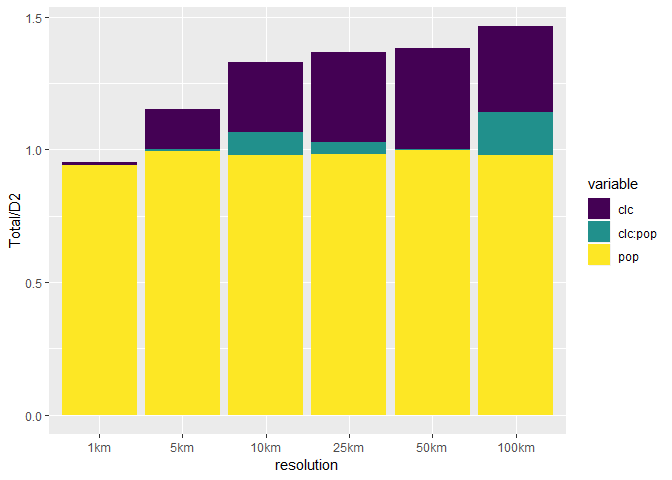

-   Importance of population increases slightly with spatial resolution. This explains the most variation in all cases
-   Importance of topography decreases with spatial resolution
-   Importance of non-built land covers decreases with spatial resolution (although increasing between 1km and 5km, but we may drop the 1km model)
-   First-order interactions are most important at intermediate resolutions (in particular the interaction between proportion of non-built land covers and population - some concerns around correlation between these, particularly at 25km resolution)

This one is without standardising by the total variance explained.

``` r
ggplot(mod_stats, aes(x = resolution, y = Total, fill = variable)) + 
  scale_fill_viridis_d() + 
  geom_bar(stat = "identity", position = "stack")
```

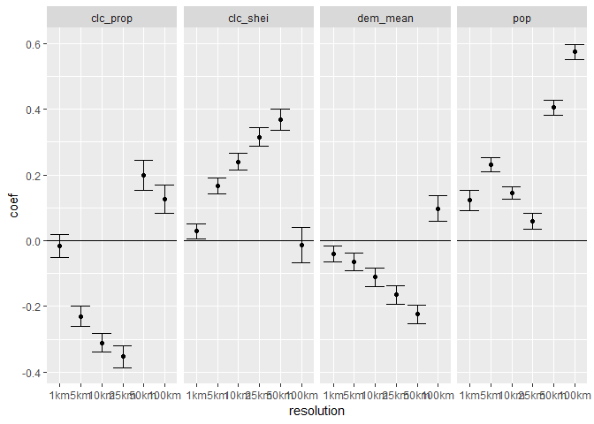

What about the relationships?

``` r
ggplot(mod_stats, aes(x = resolution, y = coef)) + 
  geom_point() + 
  geom_hline(yintercept = 0) + 
  geom_errorbar(aes(ymin = lci, ymax = uci)) + 
  facet_wrap(~variable, nrow = 1)
```

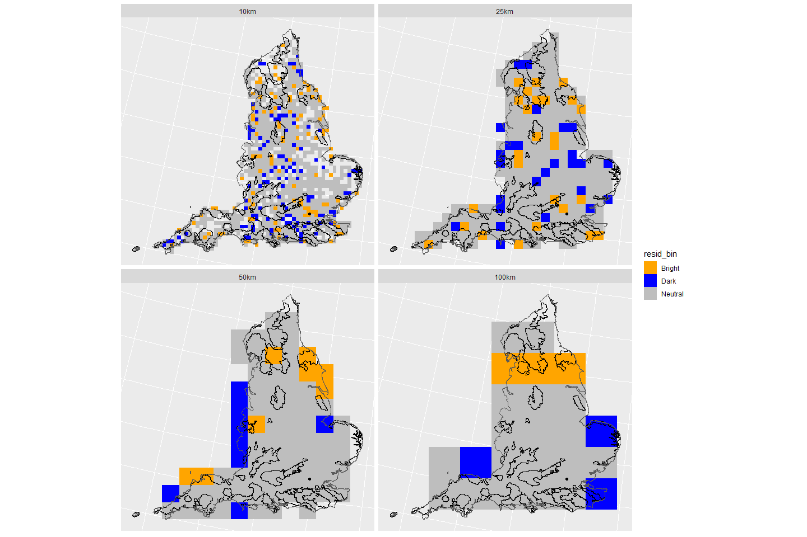

Some scale dependencies. Probably need to check they are not entirely statistical artefacts.

Bright & dark spots
-------------------

Following Frei et al. (2018) and Cinner et al. (2016), we calculate bright spots and dark spots. We define bright/dark spots as those where the observed value is +/- 1SD (of observed values) from the expected value.

``` r
bd_spots <- mod %>% 
  select(resolution, data, mod_fitted, mod_resid) %>% 
  unnest() %>% 
  group_by(resolution) %>% 
  mutate(diff = mod_fitted - mene,
         bd_spots = case_when(diff < -sd(mene) ~ "Dark",
                               diff > sd(mene) ~ "Bright",
                               TRUE ~ "Neutral"))

# potentially explanatory spatial layers
# np <- st_read("~/DATA/ADMINISTRATIVE/national_parks_england/National_Parks_England.shp",
#               quiet = TRUE) %>%
#   st_transform(st_crs(study_ext_sf))
# 
# aonb <- st_read("~/DATA/ADMINISTRATIVE/aonb_england/Areas_of_Outstanding_Natural_Beauty_England.shp",
#                 quiet = TRUE) %>%
#   st_transform(st_crs(study_ext_sf))

cities <- st_read("~/DATA/ADMINISTRATIVE/uk_cities/Major_Towns_and_Cities_December_2015_Boundaries.shp",
                  quiet = TRUE) %>%
  st_transform(st_crs(study_ext_sf)) %>%
  st_centroid %>%
  filter(tcity15nm %in% c("Birmingham", "Leeds", "London", "Manchester", "Newcastle upon Tyne"))

ggplot() + 
  geom_raster(data = bd_spots, 
              aes(x = x, y = y, fill = bd_spots)) + 
  #geom_sf(data = np, colour = "black", fill = NA) + 
  #geom_sf(data = aonb, colour = "black", fill = NA) + 
  geom_sf(data = cities, colour = "black", fill = NA) + 
  geom_sf(data = study_ext_sf, fill = NA) + 
  facet_wrap(~resolution) + 
  scale_fill_manual(values = c("orange", "blue", "grey")) + 
  theme(axis.title = element_blank(), 
        axis.text = element_blank(),
        axis.ticks = element_blank())
```

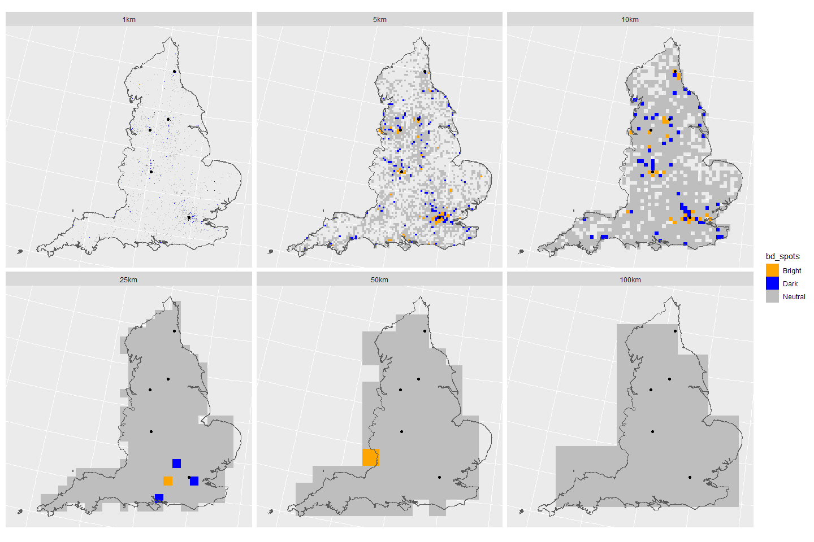

Cities marked out: London, Birmingham, Manchester, Leeds, Newcastle upon Tyne.

``` r
ggplot(bd_spots, aes(x = mod_fitted, y = mene)) + 
  geom_point(aes(colour = bd_spots)) + 
  scale_colour_manual(values = c("orange", "blue", "grey")) + 
  geom_smooth(method = "lm") + 
  facet_wrap(~resolution, scales = "free")
```

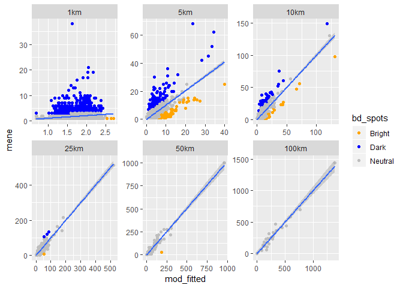

Scale dependency in the % of bright/dark spots?

``` r
bd_summary <- group_by(bd_spots, resolution) %>% 
  summarise(Bright = sum(bd_spots == "Bright"),
            Dark = sum(bd_spots == "Dark"),
            Total = n(),
            `Bright %` = (Bright/Total)*100,
            `Dark %` = (Dark/Total)*100) %>% 
  gather(key, value, -resolution, -Bright, -Dark, -Total)

ggplot(bd_summary, aes(x = resolution, y = value, colour = key, group = key)) + 
  geom_point() + 
  scale_colour_manual(values = c("orange", "blue", "grey")) + 
  stat_summary(fun.y=sum, geom="line") + 
  ylab("% of total area")
```

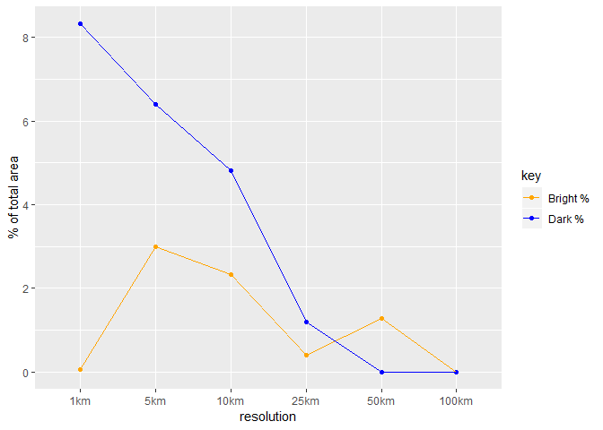

Hot & cold spots
----------------

These are the areas of maximum and minimum service provision. I'm defining hot/cold spots as those cells in the top/bottom 5%.

I'm not 100% convinced by this because of the skewed distribution.

``` r
hc_spots <- df %>% 
  group_by(resolution) %>% 
  mutate(hc_spots = case_when(mene < quantile(mene, 0.1) ~ "Cold",
                               mene > quantile(mene, 0.9) ~ "Hot",
                               TRUE ~ "Neutral"))
```

``` r
ggplot() + 
  geom_raster(data = hc_spots, 
              aes(x = x, y = y, fill = hc_spots)) + 
  #geom_sf(data = np, colour = "black", fill = NA) + 
  #geom_sf(data = aonb, colour = "black", fill = NA) + 
  geom_sf(data = cities, colour = "black", fill = NA) + 
  geom_sf(data = study_ext_sf, fill = NA) + 
  facet_wrap(~resolution) + 
  scale_fill_manual(values = c("blue", "orange", "grey")) + 
  theme(axis.title = element_blank(), 
        axis.text = element_blank(),
        axis.ticks = element_blank())
```

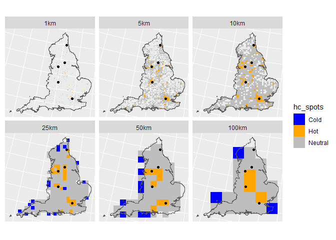

Problem in that coastal areas come out as cold spots, but that's an area thing. Might need to remove cells which are not 100% on land.

Scale dependency in the % of hot/cold spots?

``` r
hc_summary <- group_by(hc_spots, resolution) %>% 
  summarise(Hot = sum(hc_spots == "Hot"),
            Cold = sum(hc_spots == "Cold"),
            Total = n(),
            `Hot %` = (Hot/Total)*100,
            `Cold %` = (Cold/Total)*100) %>% 
  gather(key, value, -resolution, -Hot, -Cold, -Total)

ggplot(hc_summary, aes(x = resolution, y = value, colour = key, group = key)) + 
  geom_point() + 
  scale_colour_manual(values = c("blue", "orange", "grey")) + 
  stat_summary(fun.y=sum, geom="line") + 
  ylab("% of total area")
```

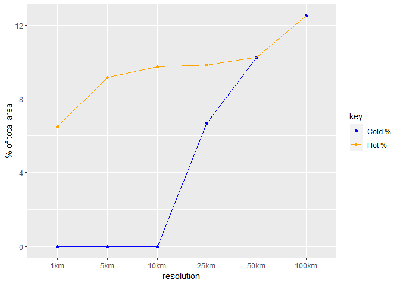

References
----------

Cinner, Joshua E., Cindy Huchery, M. Aaron MacNeil, Nicholas A.J. Graham, Tim R. McClanahan, Joseph Maina, Eva Maire, et al. 2016. “Bright spots among the world’s coral reefs.” *Nature* 535 (7612). Nature Publishing Group: 416–19. doi:[10.1038/nature18607](https://doi.org/10.1038/nature18607).

Frei, Barbara, Delphine Renard, Matthew G. E. Mitchell, Verena Seufert, Rebecca Chaplin-Kramer, Jeanine M. Rhemtulla, and Elena M. Bennett. 2018. “Bright spots in agricultural landscapes: Identifying areas exceeding expectations for multifunctionality and biodiversity.” *Journal of Applied Ecology*, no. February: 1–13. doi:[10.1111/1365-2664.13191](https://doi.org/10.1111/1365-2664.13191).

Guisan, Antoine, and Niklaus E Zimmermann. 2000. “Predictive habitat distribution models in ecology.” *Ecological Modelling* 135 (2–3): 147–86. doi:[10.1016/s0304-3800(00)00354-9](https://doi.org/10.1016/s0304-3800(00)00354-9).
