Flickr Models
================

``` r
library(hier.part)
library(MASS)
library(raster)
library(sf)
library(GGally)
library(broom)
library(MuMIn)
library(knitr)
library(tidyverse)
library(patchwork)

# resolutions
rlns <- c("1km", "5km", "10km", "25km", "50km", "100km")

# study extent (for now this is England, will need extending to Europe)
study_ext_eng_sf <- st_read("~/DATA/ADMINISTRATIVE/gb_shapefile/GBR_adm1.shp", quiet = TRUE) %>% 
  filter(NAME_1 == "England") %>% 
  st_transform(crs = 3035)

study_ext_europe_sf <- st_read("~/DATA/ADMINISTRATIVE/europe/Europe_coastline.shp", quiet = TRUE) %>% 
  st_transform(crs = 3035)


study_ext_eng <- as(study_ext_eng_sf, "Spatial")
study_ext_europe <- as(study_ext_europe_sf, "Spatial")

theme_set(theme_bw(base_size = 10) + theme(strip.background = element_blank(), 
                             panel.grid.major = element_blank(),
                             panel.grid.minor = element_blank()))
```

Data collating
--------------

We're making one big dataframe of the response (Flickr photo locations) and covariates at each of the analysis resolutions and extents.

``` r
get_df <- function(rln, study_ext) {
  # list all files of specified resolution
  fnames <- list.files("data/covariates", pattern = paste0("_", rln), full.names = TRUE)
  fnames <- c(fnames, paste0("data/response/eng_flickr_", rln, ".tif"))
  
  # stack them
  dat <- stack(fnames)
  
  # crop by study extent
  dat <- crop(dat, study_ext)
  #dat <- mask(dat, study_ext)
  
  # get into a dataframe
  df <- as.data.frame(dat, xy = TRUE) %>% 
    rename_all(funs(str_replace_all(., paste0("_", rln), ""))) %>% 
    na.omit %>% 
    mutate(resolution = rln)
  
  return(df)
}

# dataframe with obs for all data
df_eng <- map_dfr(rlns, get_df, study_ext_eng) %>% 
  mutate(resolution = factor(resolution, 
                             levels = c("1km", 
                                        "5km", 
                                        "10km", 
                                        "25km", 
                                        "50km", 
                                        "100km")),
         extent = "England")

df_europe <- map_dfr(rlns, get_df, study_ext_europe) %>% 
  mutate(resolution = factor(resolution, 
                             levels = c("1km", 
                                        "5km", 
                                        "10km", 
                                        "25km", 
                                        "50km", 
                                        "100km")),
         extent = "Europe")

df <- bind_rows(df_eng, df_europe) %>% 
  rename(flickr = eng_flickr)

save(df, file = "flickr_df.Rda")
```

Data exploration
----------------

First, let's just see whether there is sufficient variability and n in each resolution to fit models.

``` r
ggplot(df, aes(x = flickr)) + 
  geom_histogram() + 
  facet_grid(resolution~extent, scales = "free")
```

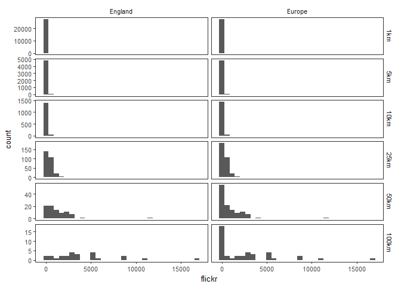

``` r
df %>% 
  group_by(extent, resolution) %>% 
  summarise(count = n())
```

    ## # A tibble: 12 x 3
    ## # Groups:   extent [?]
    ##    extent  resolution count
    ##    <chr>   <fct>      <int>
    ##  1 England 1km        27668
    ##  2 England 5km         4808
    ##  3 England 10km        1455
    ##  4 England 25km         273
    ##  5 England 50km          85
    ##  6 England 100km         25
    ##  7 Europe  1km        27731
    ##  8 Europe  5km         4862
    ##  9 Europe  10km        1503
    ## 10 Europe  25km         316
    ## 11 Europe  50km         120
    ## 12 Europe  100km         41

Based on the distributions, we can fit models for all resolutions, but for the larger two (50km and 100km), n is very small.

We can also inspect the spatial coverage of the Flickr data.

``` r
ggplot(df, aes(x = x, y = y)) + 
  geom_raster() + 
  coord_equal() + 
  facet_grid(resolution~extent) + 
  theme(axis.title = element_blank(), 
        axis.text = element_blank(),
        axis.ticks = element_blank())
```

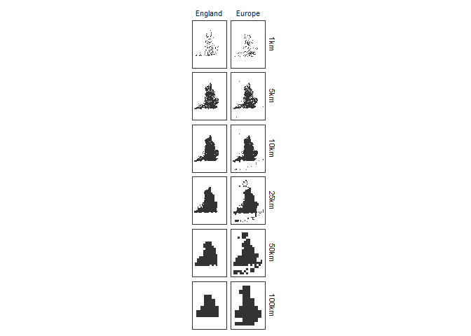

Good coverage at all but 1km. Even that is better than the MENE data though and worth seeing if we can use it (n = 26715 rather than n = 5021).

Finally, lets look at the relationships between variables:

``` r
p <- list()

for(r in rlns) {
  p[[r]] <- ggpairs(df %>% filter(resolution == r, extent == "England") %>% select(-resolution, -x, -y), progress = FALSE)
}

p
```

    ## $`1km`

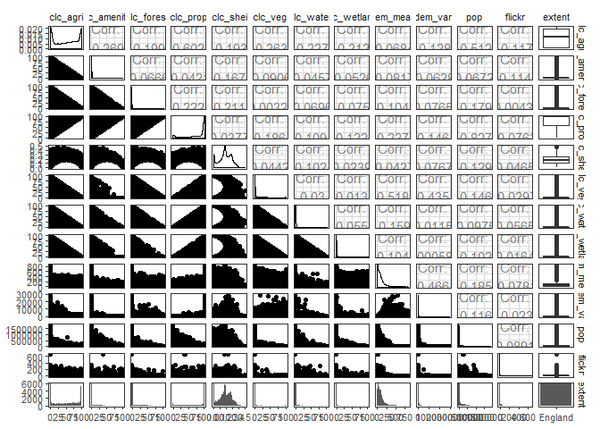

    ## 
    ## $`5km`

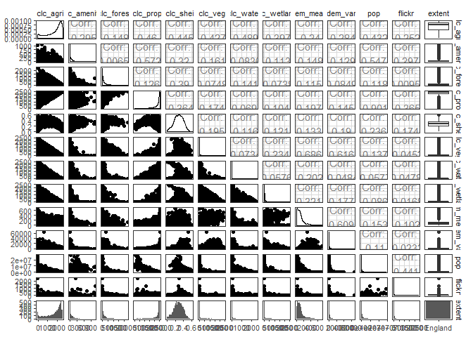

    ## 
    ## $`10km`

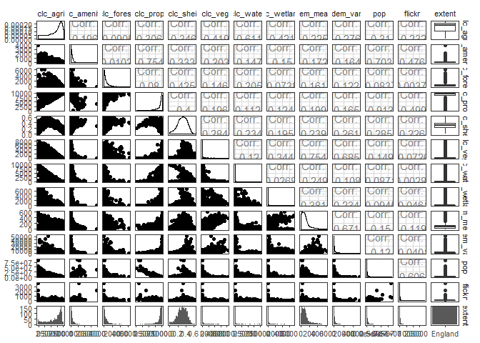

    ## 
    ## $`25km`

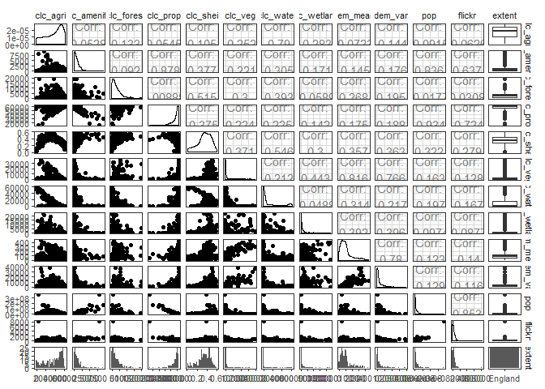

    ## 
    ## $`50km`

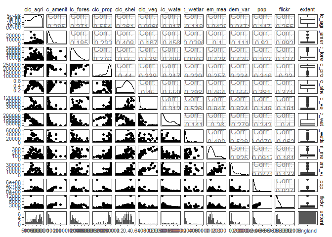

    ## 
    ## $`100km`

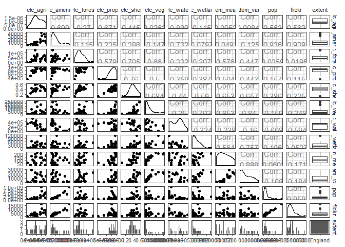

Seems that it's population and proportion of non-built land covers that are the strongest predictor at all resolutions, and that this effect increases with spatial resolution. LC diversity is next, with similar effect. Note that population density and proportion of non-built land covers are highly correlated at all resolutions except for 50km and 100km.

``` r
p <- list()

for(r in rlns) {
  p[[r]] <- ggpairs(df %>% filter(resolution == r, extent == "Europe") %>% select(-resolution, -x, -y), progress = FALSE)
}

p
```

    ## $`1km`


    ## 
    ## $`5km`


    ## 
    ## $`10km`

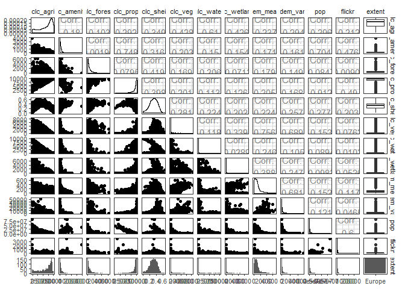

    ## 
    ## $`25km`

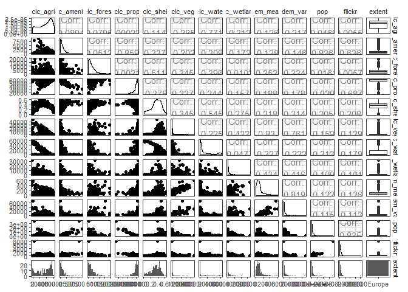

    ## 
    ## $`50km`

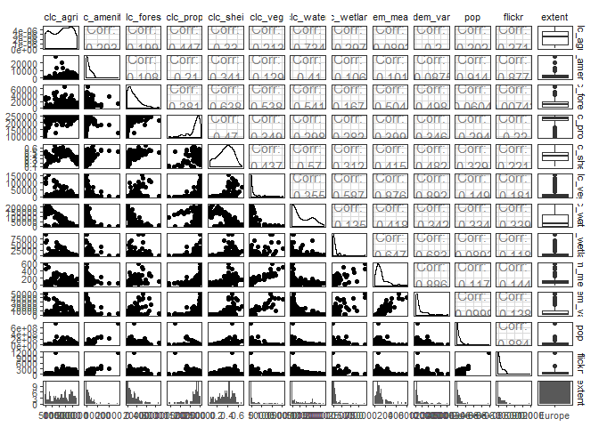

    ## 
    ## $`100km`

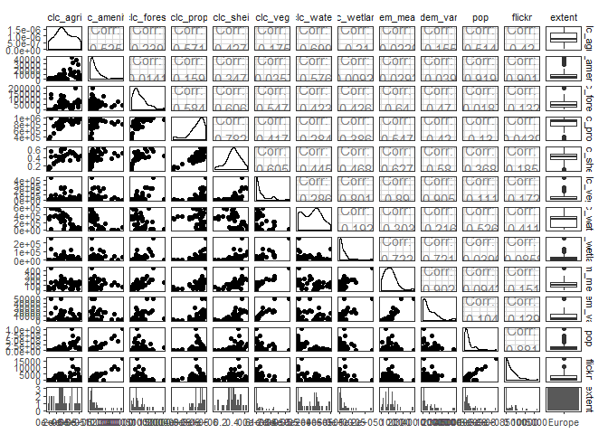 \#\# Statistical Models

We will fit negative binomial GLMs (due to overdispersion) with proportion of non-built land cover (clc\_prop), mean elevation (dem\_mean) and population (pop) and their first-order interactions as the full model.

``` r
fit_mod <- function(dat) {
  glm(flickr ~ clc_agri + clc_forest + clc_shei + clc_veg + clc_water + clc_wetland + pop,
      family = "poisson",
      data = dat)
}

part_var <- function(dat) {
  resp <- dat %>% pull(flickr)
  pred <- dat %>% dplyr::select(clc_agri, clc_forest, clc_shei, clc_water, clc_wetland, pop)
  
  part <- hier.part(resp, pred, family = "poisson", gof = "logLik", barplot = FALSE)$I.perc
  
  out <- tibble(var = rownames(part), expl = part$I)
}

scale_cols <- function(x) {
  scale_this <- function(y) as.vector(scale(y))
  #x <- x %>% mutate(pop = log(pop + 1))
  mutate_at(x, .vars = vars(-flickr), .funs = funs(scale_this))
}

# get the CA function
source("../upscaling/R/ca_glm.R")

# get all of the required stats
get_mod_stats <- function(mod) {
  coeff <- coef(mod)[-1] %>% 
    data.frame %>% 
    as_tibble(rownames = "variable") %>% 
    rename(coef = 2)
  
  conf <- confint(mod)[-1,] %>% 
    data.frame %>% 
    as_tibble(rownames = "variable") %>% 
    rename(lci = X2.5.., uci = X97.5..)
  
  ca <- calc_commonality(mod)$CCTotalbyVar %>% 
    as_tibble(rownames = "variable")
  
  out <- inner_join(coeff, conf) %>% 
    inner_join(ca) %>% 
    mutate(
      r_s = map_dbl(variable, function(x) {
        out <- cor(model.matrix(mod)[,x], mod$fitted.values)
      }),
      r_s2 = r_s^2)
  
  return(out)
}

mod <- df %>% 
  group_by(extent, resolution) %>% 
  nest() %>% 
  mutate(data_scaled = map(data, scale_cols),
         mod = map(data_scaled, fit_mod),
         mod_glance = map(mod, glance),
         mod_stats = map(mod, get_mod_stats),
         mod_part = map(data_scaled, part_var),
         mod_resid = map(mod, resid),
         mod_fitted = map(mod, fitted))

mod_D2 <- mod %>%
  dplyr::select(extent, resolution, mod_glance) %>% 
  unnest() %>% 
  mutate(D2 = (null.deviance - deviance)/null.deviance) %>% 
  dplyr::select(extent, resolution, D2)

mod_part <- mod %>% 
  dplyr::select(extent, resolution, mod_part) %>% 
  unnest()

mod_stats <- mod %>%
  dplyr::select(extent, resolution, mod_stats) %>% 
  unnest()
```

TODO: Testing residuals with DHARMa showed overdispersion with strong patterns in the residuals for CLC and POP. Would be worth fitting a quadratic term for each of these. Even with population logged, there are some low population cells (even at 100km level) with high residual values.

How well do they fit? NB We are using *D*<sup>2</sup>, which is equivalent to *R*<sup>2</sup> (Guisan and Zimmermann 2000). Note also that due to the differences in sample size, *D*<sup>2</sup> values are not directly comparable.

``` r
ggplot(mod_D2, aes(x = resolution, y = D2, group = 1)) + 
  geom_point() +
  facet_wrap(~extent) + 
  stat_summary(fun.y=sum, geom="line")
```

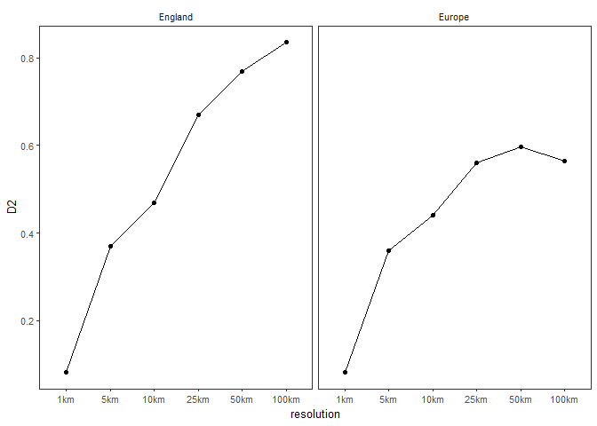

Explanatory power of the model increases greatly between 1km and 5km resolutions (with increasing explanatory power as resolution increases, as to be expected). Might be best to drop the 1km model.

What about the relative importances?

NB This plot shows the proportion of variance explained by each variable of the total variance explained. It's greater than 1 because there are shared explained variances

``` r
d2 <- ggplot(mod_D2, aes(x = resolution, y = D2)) + 
  geom_bar(stat = "identity") + 
  facet_wrap(~extent) + 
  labs(x = "", y = expression(D^{2})) + 
  theme(axis.text.x = element_blank(),
        axis.ticks.x = element_blank())

varpart <- ggplot(mod_part, aes(x = resolution, y = expl, fill = var)) + 
  scale_fill_viridis_d(name = "Variable") + 
  geom_bar(stat = "identity", position = "stack") + 
  facet_wrap(~extent) + 
  labs(x = "Resolution", y = "Variance explained %")

d2 + varpart + 
  plot_layout(ncol = 1, heights = c(1, 3)) + 
  plot_annotation(tag_levels = "a", tag_suffix = ")")
```

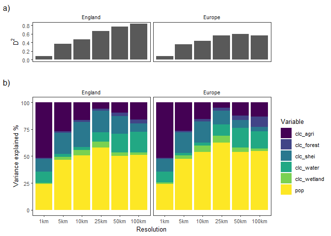

-   Scale dependencies seem a bit more clear cut with this one (than MENE data).
-   Importance of agriculture decreases with resolution
-   Importance of population increases with resolution
-   there's a quadratic effect of diversity (important at mid-level resolutions - is this where it is captured? 1km too small to capture, 100km there is far more within- than among-unit variation?)
-   Water important at 1km, but then not until 50km.
-   Forest really not important at all but the coarsest resolutions.
-   *D*<sup>2</sup> increase more stable/linear than with the MENE data

What about the relationships?

``` r
ggplot(mod_stats, aes(x = resolution, y = coef)) + 
  geom_point() + 
  geom_hline(yintercept = 0) + 
  geom_errorbar(aes(ymin = lci, ymax = uci)) + 
  facet_grid(extent~variable)
```

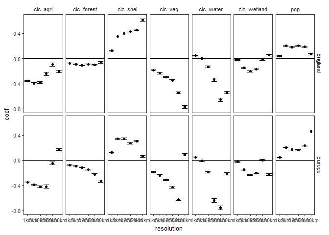

-   Agriculture always negative
-   Forest often negative except at 100km
-   Quadratic effect with diversity (strongest relationship at mid-resolutions)
-   Vegetation always negative
-   Water becomes negative at 10km and then becomes very negative at highest resolutions (likely an effect of losing high % water cells?)
-   Population always positive, but the strength varies.

Bright & dark spots
-------------------

Following Frei et al. (2018) and Cinner et al. (2016), we calculate bright spots and dark spots. We define bright/dark spots as those where the observed value is +/- 1SD (of observed values) from the expected value.

``` r
bd_spots <- mod %>% 
  select(extent, resolution, data, mod_fitted, mod_resid) %>% 
  unnest() %>% 
  group_by(resolution) %>% 
  mutate(diff = mod_fitted - flickr,
         bd_spots = case_when(diff < -sd(flickr) ~ "Dark",
                               diff > sd(flickr) ~ "Bright",
                               TRUE ~ "Neutral"))

# potentially explanatory spatial layers
# np <- st_read("~/DATA/ADMINISTRATIVE/national_parks_england/National_Parks_England.shp",
#               quiet = TRUE) %>%
#   st_transform(st_crs(study_ext_sf))
# 
# aonb <- st_read("~/DATA/ADMINISTRATIVE/aonb_england/Areas_of_Outstanding_Natural_Beauty_England.shp",
#                 quiet = TRUE) %>%
#   st_transform(st_crs(study_ext_sf))

# cities <- st_read("~/DATA/ADMINISTRATIVE/uk_cities/Major_Towns_and_Cities_December_2015_Boundaries.shp",
#                   quiet = TRUE) %>%
#   st_transform(st_crs(study_ext_sf)) %>%
#   st_centroid %>%
#   filter(tcity15nm %in% c("Birmingham", "Leeds", "London", "Manchester", "Newcastle upon Tyne"))
# 
ggplot() + 
  geom_raster(data = bd_spots %>% filter(extent == "Europe"), 
              aes(x = x, y = y, fill = bd_spots)) + 
  #geom_sf(data = np, colour = "black", fill = NA) + 
  #geom_sf(data = aonb, colour = "black", fill = NA) + 
  #geom_sf(data = cities, colour = "black", fill = NA) + 
  geom_sf(data = study_ext_europe_sf, fill = NA) + 
  facet_wrap(~resolution) + 
  scale_fill_manual(values = c("orange", "blue", "grey")) + 
  theme(axis.title = element_blank(), 
        axis.text = element_blank(),
        axis.ticks = element_blank())
```

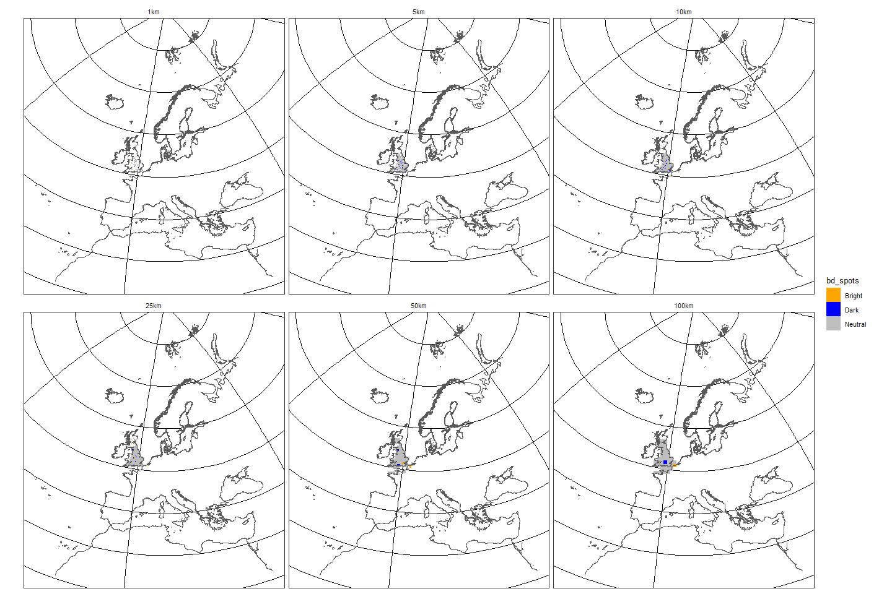

``` r
ggplot() + 
  geom_raster(data = bd_spots %>% filter(extent == "England"), 
              aes(x = x, y = y, fill = bd_spots)) + 
  #geom_sf(data = np, colour = "black", fill = NA) + 
  #geom_sf(data = aonb, colour = "black", fill = NA) + 
  #geom_sf(data = cities, colour = "black", fill = NA) + 
  geom_sf(data = study_ext_eng_sf, fill = NA) + 
  facet_wrap(~resolution) + 
  scale_fill_manual(values = c("orange", "blue", "grey")) + 
  theme(axis.title = element_blank(), 
        axis.text = element_blank(),
        axis.ticks = element_blank())
```

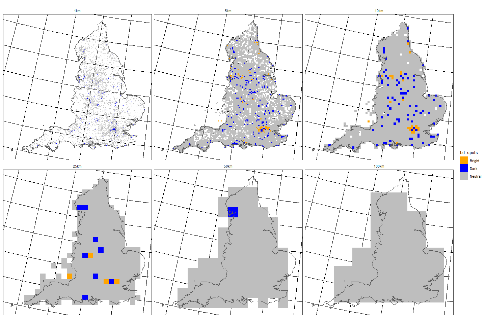

Cities marked out: London, Birmingham, Manchester, Leeds, Newcastle upon Tyne.

``` r
ggplot(bd_spots, aes(x = mod_fitted, y = flickr)) + 
  geom_point(aes(colour = bd_spots)) + 
  scale_colour_manual(values = c("orange", "blue", "grey")) + 
  geom_smooth(method = "lm") + 
  facet_wrap(~resolution, scales = "free")
```

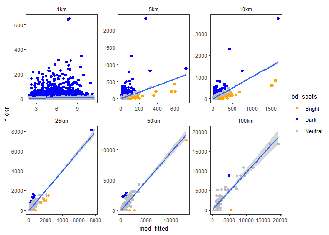

Again problems with the 1km model.

Scale dependency in the % of bright/dark spots?

``` r
bd_summary <- group_by(bd_spots, resolution) %>% 
  summarise(Bright = sum(bd_spots == "Bright"),
            Dark = sum(bd_spots == "Dark"),
            Total = n(),
            `Bright %` = (Bright/Total)*100,
            `Dark %` = (Dark/Total)*100) %>% 
  gather(key, value, -resolution, -Bright, -Dark, -Total)

ggplot(bd_summary, aes(x = resolution, y = value, colour = key, group = key)) + 
  geom_point() + 
  scale_colour_manual(values = c("orange", "blue", "grey")) + 
  stat_summary(fun.y=sum, geom="line") + 
  ylab("% of total area")
```

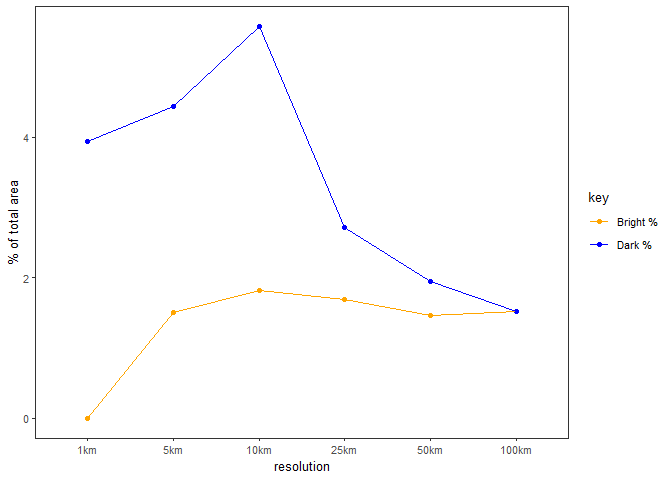

References
----------

Session Info
------------

``` r
session <- devtools::session_info()
session[[1]]
```

    ##  setting  value                       
    ##  version  R version 3.5.0 (2018-04-23)
    ##  system   x86_64, mingw32             
    ##  ui       RTerm                       
    ##  language (EN)                        
    ##  collate  English_United Kingdom.1252 
    ##  tz       Europe/London               
    ##  date     2018-09-09

``` r
session[[2]] %>% kable
```

| package      | \*  | version | date       | source                                 |
|:-------------|:----|:--------|:-----------|:---------------------------------------|
| assertthat   |     | 0.2.0   | 2017-04-11 | CRAN (R 3.5.0)                         |
| backports    |     | 1.1.2   | 2017-12-13 | CRAN (R 3.5.0)                         |
| base         | \*  | 3.5.0   | 2018-04-23 | local                                  |
| bindr        |     | 0.1.1   | 2018-03-13 | CRAN (R 3.5.0)                         |
| bindrcpp     | \*  | 0.2.2   | 2018-03-29 | CRAN (R 3.5.0)                         |
| broom        | \*  | 0.4.4   | 2018-03-29 | CRAN (R 3.5.0)                         |
| cellranger   |     | 1.1.0   | 2016-07-27 | CRAN (R 3.5.0)                         |
| class        |     | 7.3-14  | 2015-08-30 | CRAN (R 3.5.0)                         |
| classInt     |     | 0.2-3   | 2018-04-16 | CRAN (R 3.5.0)                         |
| cli          |     | 1.0.0   | 2017-11-05 | CRAN (R 3.5.0)                         |
| colorspace   |     | 1.3-2   | 2016-12-14 | CRAN (R 3.5.0)                         |
| compiler     |     | 3.5.0   | 2018-04-23 | local                                  |
| crayon       |     | 1.3.4   | 2017-09-16 | CRAN (R 3.5.0)                         |
| datasets     | \*  | 3.5.0   | 2018-04-23 | local                                  |
| DBI          |     | 1.0.0   | 2018-05-02 | CRAN (R 3.5.0)                         |
| devtools     |     | 1.13.5  | 2018-02-18 | CRAN (R 3.5.0)                         |
| digest       |     | 0.6.15  | 2018-01-28 | CRAN (R 3.5.0)                         |
| dplyr        | \*  | 0.7.6   | 2018-06-29 | CRAN (R 3.5.1)                         |
| e1071        |     | 1.6-8   | 2017-02-02 | CRAN (R 3.5.0)                         |
| evaluate     |     | 0.10.1  | 2017-06-24 | CRAN (R 3.5.0)                         |
| forcats      | \*  | 0.3.0   | 2018-02-19 | CRAN (R 3.5.0)                         |
| foreign      |     | 0.8-71  | 2018-07-20 | CRAN (R 3.5.1)                         |
| GGally       | \*  | 1.4.0   | 2018-05-17 | CRAN (R 3.5.0)                         |
| ggplot2      | \*  | 3.0.0   | 2018-07-03 | CRAN (R 3.5.1)                         |
| glue         |     | 1.3.0   | 2018-07-17 | CRAN (R 3.5.1)                         |
| graphics     | \*  | 3.5.0   | 2018-04-23 | local                                  |
| grDevices    | \*  | 3.5.0   | 2018-04-23 | local                                  |
| grid         |     | 3.5.0   | 2018-04-23 | local                                  |
| gtable       |     | 0.2.0   | 2016-02-26 | CRAN (R 3.5.0)                         |
| gtools       | \*  | 3.5.0   | 2015-05-29 | CRAN (R 3.5.0)                         |
| haven        |     | 1.1.1   | 2018-01-18 | CRAN (R 3.5.0)                         |
| hier.part    | \*  | 1.0-4   | 2013-01-08 | CRAN (R 3.5.0)                         |
| hms          |     | 0.4.2   | 2018-03-10 | CRAN (R 3.5.0)                         |
| htmltools    |     | 0.3.6   | 2017-04-28 | CRAN (R 3.5.0)                         |
| httr         |     | 1.3.1   | 2017-08-20 | CRAN (R 3.5.0)                         |
| jsonlite     |     | 1.5     | 2017-06-01 | CRAN (R 3.5.0)                         |
| knitr        | \*  | 1.20    | 2018-02-20 | CRAN (R 3.5.0)                         |
| labeling     |     | 0.3     | 2014-08-23 | CRAN (R 3.5.0)                         |
| lattice      |     | 0.20-35 | 2017-03-25 | CRAN (R 3.5.0)                         |
| lazyeval     |     | 0.2.1   | 2017-10-29 | CRAN (R 3.5.0)                         |
| lubridate    |     | 1.7.4   | 2018-04-11 | CRAN (R 3.5.0)                         |
| magrittr     |     | 1.5     | 2014-11-22 | CRAN (R 3.5.0)                         |
| MASS         | \*  | 7.3-49  | 2018-02-23 | CRAN (R 3.5.0)                         |
| Matrix       |     | 1.2-14  | 2018-04-13 | CRAN (R 3.5.0)                         |
| memoise      |     | 1.1.0   | 2017-04-21 | CRAN (R 3.5.0)                         |
| methods      | \*  | 3.5.0   | 2018-04-23 | local                                  |
| mnormt       |     | 1.5-5   | 2016-10-15 | CRAN (R 3.5.0)                         |
| modelr       |     | 0.1.2   | 2018-05-11 | CRAN (R 3.5.0)                         |
| MuMIn        | \*  | 1.40.4  | 2018-01-30 | CRAN (R 3.5.0)                         |
| munsell      |     | 0.4.3   | 2016-02-13 | CRAN (R 3.5.0)                         |
| nlme         |     | 3.1-137 | 2018-04-07 | CRAN (R 3.5.0)                         |
| parallel     |     | 3.5.0   | 2018-04-23 | local                                  |
| patchwork    | \*  | 0.0.1   | 2018-07-20 | Github (<thomasp85/patchwork@7fb35b1>) |
| pillar       |     | 1.2.2   | 2018-04-26 | CRAN (R 3.5.0)                         |
| pkgconfig    |     | 2.0.1   | 2017-03-21 | CRAN (R 3.5.0)                         |
| plyr         |     | 1.8.4   | 2016-06-08 | CRAN (R 3.5.0)                         |
| psych        |     | 1.8.4   | 2018-05-06 | CRAN (R 3.5.0)                         |
| purrr        | \*  | 0.2.5   | 2018-05-29 | CRAN (R 3.5.1)                         |
| R6           |     | 2.2.2   | 2017-06-17 | CRAN (R 3.5.0)                         |
| raster       | \*  | 2.6-7   | 2017-11-13 | CRAN (R 3.5.1)                         |
| RColorBrewer |     | 1.1-2   | 2014-12-07 | CRAN (R 3.5.0)                         |
| Rcpp         |     | 0.12.18 | 2018-07-23 | CRAN (R 3.5.1)                         |
| readr        | \*  | 1.1.1   | 2017-05-16 | CRAN (R 3.5.0)                         |
| readxl       |     | 1.1.0   | 2018-04-20 | CRAN (R 3.5.0)                         |
| reshape      |     | 0.8.7   | 2017-08-06 | CRAN (R 3.5.0)                         |
| reshape2     |     | 1.4.3   | 2017-12-11 | CRAN (R 3.5.0)                         |
| rgdal        |     | 1.3-4   | 2018-08-03 | CRAN (R 3.5.1)                         |
| rlang        |     | 0.2.1   | 2018-05-30 | CRAN (R 3.5.1)                         |
| rmarkdown    |     | 1.10    | 2018-06-11 | CRAN (R 3.5.0)                         |
| rprojroot    |     | 1.3-2   | 2018-01-03 | CRAN (R 3.5.0)                         |
| rstudioapi   |     | 0.7     | 2017-09-07 | CRAN (R 3.5.0)                         |
| rvest        |     | 0.3.2   | 2016-06-17 | CRAN (R 3.5.0)                         |
| scales       |     | 0.5.0   | 2017-08-24 | CRAN (R 3.5.0)                         |
| sf           | \*  | 0.6-3   | 2018-05-17 | CRAN (R 3.5.1)                         |
| sp           | \*  | 1.2-7   | 2018-01-19 | CRAN (R 3.5.0)                         |
| spData       |     | 0.2.8.3 | 2018-03-25 | CRAN (R 3.5.0)                         |
| stats        | \*  | 3.5.0   | 2018-04-23 | local                                  |
| stats4       |     | 3.5.0   | 2018-04-23 | local                                  |
| stringi      |     | 1.1.7   | 2018-03-12 | CRAN (R 3.5.0)                         |
| stringr      | \*  | 1.3.1   | 2018-05-10 | CRAN (R 3.5.0)                         |
| tibble       | \*  | 1.4.2   | 2018-01-22 | CRAN (R 3.5.0)                         |
| tidyr        | \*  | 0.8.0   | 2018-01-29 | CRAN (R 3.5.0)                         |
| tidyselect   |     | 0.2.4   | 2018-02-26 | CRAN (R 3.5.0)                         |
| tidyverse    | \*  | 1.2.1   | 2017-11-14 | CRAN (R 3.5.0)                         |
| tools        |     | 3.5.0   | 2018-04-23 | local                                  |
| udunits2     |     | 0.13    | 2016-11-17 | CRAN (R 3.5.0)                         |
| units        |     | 0.5-1   | 2018-01-08 | CRAN (R 3.5.0)                         |
| utf8         |     | 1.1.3   | 2018-01-03 | CRAN (R 3.5.0)                         |
| utils        | \*  | 3.5.0   | 2018-04-23 | local                                  |
| viridisLite  |     | 0.3.0   | 2018-02-01 | CRAN (R 3.5.0)                         |
| withr        |     | 2.1.2   | 2018-07-20 | Github (<jimhester/withr@fe56f20>)     |
| xml2         |     | 1.2.0   | 2018-01-24 | CRAN (R 3.5.0)                         |
| yaml         |     | 2.1.19  | 2018-05-01 | CRAN (R 3.5.0)                         |

Cinner, Joshua E., Cindy Huchery, M. Aaron MacNeil, Nicholas A.J. Graham, Tim R. McClanahan, Joseph Maina, Eva Maire, et al. 2016. “Bright spots among the world’s coral reefs.” *Nature* 535 (7612). Nature Publishing Group: 416–19. doi:[10.1038/nature18607](https://doi.org/10.1038/nature18607).

Frei, Barbara, Delphine Renard, Matthew G. E. Mitchell, Verena Seufert, Rebecca Chaplin-Kramer, Jeanine M. Rhemtulla, and Elena M. Bennett. 2018. “Bright spots in agricultural landscapes: Identifying areas exceeding expectations for multifunctionality and biodiversity.” *Journal of Applied Ecology*, no. February: 1–13. doi:[10.1111/1365-2664.13191](https://doi.org/10.1111/1365-2664.13191).

Guisan, Antoine, and Niklaus E Zimmermann. 2000. “Predictive habitat distribution models in ecology.” *Ecological Modelling* 135 (2–3): 147–86. doi:[10.1016/s0304-3800(00)00354-9](https://doi.org/10.1016/s0304-3800(00)00354-9).
