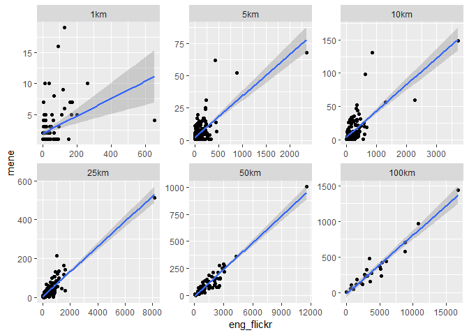
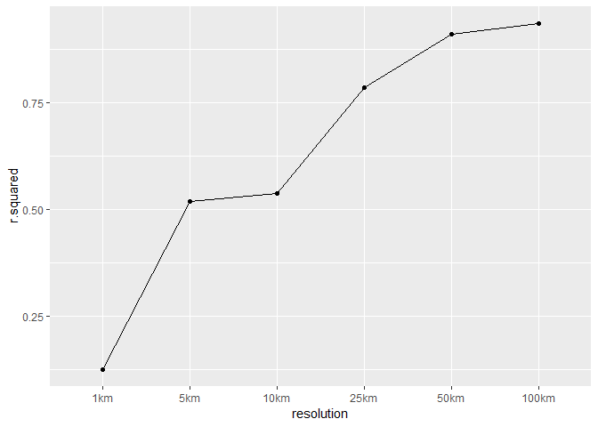
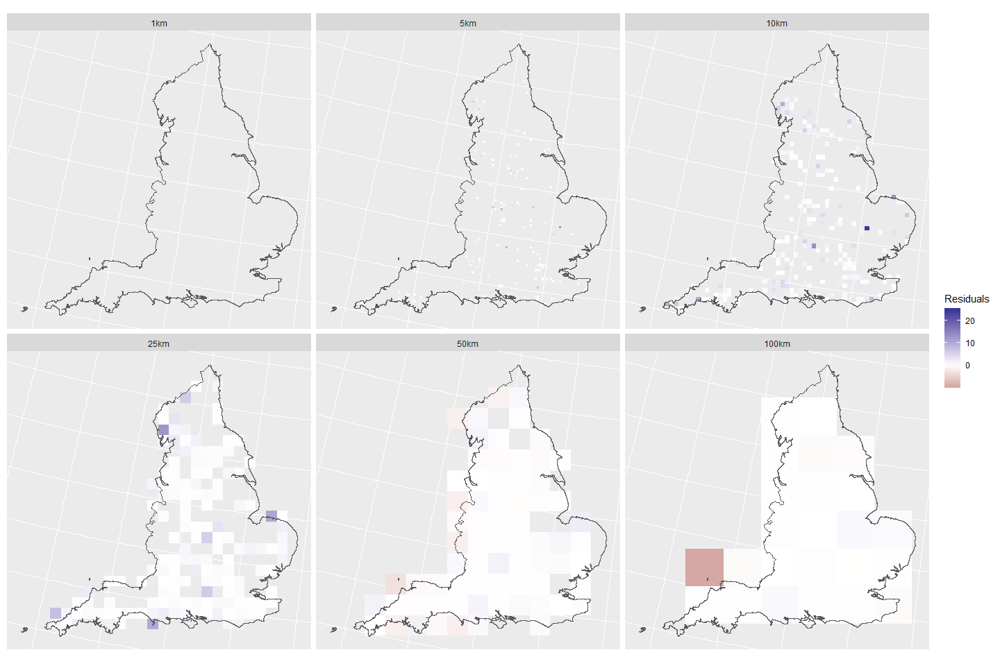

Model Comparison
================

``` r
library(MASS)
library(raster)
library(sf)
library(GGally)
library(broom)
library(MuMIn)
library(knitr)
library(tidyverse)

# resolutions
rlns <- c("1km", "5km", "10km", "25km", "50km", "100km")

# study extent (for now this is England, will need extending to Europe)
study_ext_sf <- st_read("~/DATA/ADMINISTRATIVE/gb_shapefile/GBR_adm1.shp", quiet = TRUE) %>% 
  filter(NAME_1 == "England") %>% 
  st_transform(crs = 3035)

study_ext <- as(study_ext_sf, "Spatial")
```

Data collating
--------------

We're making one big dataframe of the response (Flickr photo locations) and covariates (proportion of non-built land covers, land-cover diversity, mean elevation, topographic variation and population density) at each of the analysis resolutions.

``` r
get_df <- function(rln) {
  # list all files of specified resolution
  fnames <- list.files("data/response", pattern = paste0("_", rln), full.names = TRUE)
  
  #fnames <- fnames[!str_detect(fnames, "mene")]
  # stack them
  dat <- stack(fnames)
  
  # crop by study extent
  dat <- crop(dat, study_ext)
  
  # get into a dataframe
  df <- as.data.frame(dat, xy = TRUE) %>% 
    rename_all(funs(str_replace_all(., paste0("_", rln), ""))) %>% 
    na.omit %>% 
    mutate(resolution = rln)
  
  return(df)
}

# dataframe with obs for all data
df <- map_dfr(rlns, get_df) %>% 
  mutate(resolution = factor(resolution, 
                             levels = c("1km", 
                                        "5km", 
                                        "10km", 
                                        "25km", 
                                        "50km", 
                                        "100km")))
```

Data comparison
---------------

How well does the Flickr data predict the MENE data, and where do they differ.

``` r
ggplot(df, aes(x = eng_flickr, y = mene)) +
  geom_point() + 
  geom_smooth(method = "lm") + 
  facet_wrap(~resolution, scale = "free")
```



Let's fit some linear models so we can look at the overall fit.

``` r
fit_mod <- function(dat) {
  lm(mene ~ eng_flickr,
      data = dat)
}

mod <- df %>% 
  group_by(resolution) %>% 
  nest() %>% 
  mutate(mod = map(data, fit_mod),
         mod_glance = map(mod, glance),
         mod_fitted = map(mod, fitted))

mod_r2 <- mod %>%
  select(resolution, mod_glance) %>% 
  unnest() %>% 
  select(resolution, r.squared)
```

``` r
ggplot(mod_r2, aes(x = resolution, y = r.squared, group = 1)) + 
  geom_point() + 
  stat_summary(fun.y=sum, geom="line")
```



This is a really similar pattern to both the flickr and mene models. I think this tells us more about how *R*<sup>2</sup> improves as resolution coarsens than anything else...

Fine resolution mene data picks out dog walkers, flickr data picks out "nice"/aesthetic etc. visits (perhaps holidays?)

-   Chloe working on interspersion - viewsheds/gravity models

We can use the residuals to look at where the data sources differ.

``` r
resids <- mod %>% 
  select(resolution, data, mod_fitted) %>% 
  unnest() %>% 
  group_by(resolution) %>% 
  mutate(diff = (mod_fitted - mene)/mene)

ggplot() + 
  geom_raster(data = resids, 
              aes(x = x, y = y, fill = diff)) + 
  geom_sf(data = study_ext_sf, fill = NA) + 
  facet_wrap(~resolution) + 
  scale_fill_gradient2("Residuals") + 
  theme(axis.title = element_blank(), 
        axis.text = element_blank(),
        axis.ticks = element_blank())
```



Negative residuals show us areas which are over-represented by MENE records, negative residuals show us areas that are over-represented by Flickr records. More areas over-represented by Flickr at all resolutions.

References
----------

Session Info
------------

``` r
session <- devtools::session_info()
session[[1]]
```

    ##  setting  value                       
    ##  version  R version 3.5.0 (2018-04-23)
    ##  system   x86_64, mingw32             
    ##  ui       RTerm                       
    ##  language (EN)                        
    ##  collate  English_United Kingdom.1252 
    ##  tz       Europe/London               
    ##  date     2018-09-09

``` r
session[[2]] %>% kable
```

| package      | \*  | version | date       | source                             |
|:-------------|:----|:--------|:-----------|:-----------------------------------|
| assertthat   |     | 0.2.0   | 2017-04-11 | CRAN (R 3.5.0)                     |
| backports    |     | 1.1.2   | 2017-12-13 | CRAN (R 3.5.0)                     |
| base         | \*  | 3.5.0   | 2018-04-23 | local                              |
| bindr        |     | 0.1.1   | 2018-03-13 | CRAN (R 3.5.0)                     |
| bindrcpp     | \*  | 0.2.2   | 2018-03-29 | CRAN (R 3.5.0)                     |
| broom        | \*  | 0.4.4   | 2018-03-29 | CRAN (R 3.5.0)                     |
| cellranger   |     | 1.1.0   | 2016-07-27 | CRAN (R 3.5.0)                     |
| class        |     | 7.3-14  | 2015-08-30 | CRAN (R 3.5.0)                     |
| classInt     |     | 0.2-3   | 2018-04-16 | CRAN (R 3.5.0)                     |
| cli          |     | 1.0.0   | 2017-11-05 | CRAN (R 3.5.0)                     |
| colorspace   |     | 1.3-2   | 2016-12-14 | CRAN (R 3.5.0)                     |
| compiler     |     | 3.5.0   | 2018-04-23 | local                              |
| crayon       |     | 1.3.4   | 2017-09-16 | CRAN (R 3.5.0)                     |
| datasets     | \*  | 3.5.0   | 2018-04-23 | local                              |
| DBI          |     | 1.0.0   | 2018-05-02 | CRAN (R 3.5.0)                     |
| devtools     |     | 1.13.5  | 2018-02-18 | CRAN (R 3.5.0)                     |
| digest       |     | 0.6.15  | 2018-01-28 | CRAN (R 3.5.0)                     |
| dplyr        | \*  | 0.7.6   | 2018-06-29 | CRAN (R 3.5.1)                     |
| e1071        |     | 1.6-8   | 2017-02-02 | CRAN (R 3.5.0)                     |
| evaluate     |     | 0.10.1  | 2017-06-24 | CRAN (R 3.5.0)                     |
| forcats      | \*  | 0.3.0   | 2018-02-19 | CRAN (R 3.5.0)                     |
| foreign      |     | 0.8-71  | 2018-07-20 | CRAN (R 3.5.1)                     |
| GGally       | \*  | 1.4.0   | 2018-05-17 | CRAN (R 3.5.0)                     |
| ggplot2      | \*  | 3.0.0   | 2018-07-03 | CRAN (R 3.5.1)                     |
| glue         |     | 1.3.0   | 2018-07-17 | CRAN (R 3.5.1)                     |
| graphics     | \*  | 3.5.0   | 2018-04-23 | local                              |
| grDevices    | \*  | 3.5.0   | 2018-04-23 | local                              |
| grid         |     | 3.5.0   | 2018-04-23 | local                              |
| gtable       |     | 0.2.0   | 2016-02-26 | CRAN (R 3.5.0)                     |
| haven        |     | 1.1.1   | 2018-01-18 | CRAN (R 3.5.0)                     |
| hms          |     | 0.4.2   | 2018-03-10 | CRAN (R 3.5.0)                     |
| htmltools    |     | 0.3.6   | 2017-04-28 | CRAN (R 3.5.0)                     |
| httr         |     | 1.3.1   | 2017-08-20 | CRAN (R 3.5.0)                     |
| jsonlite     |     | 1.5     | 2017-06-01 | CRAN (R 3.5.0)                     |
| knitr        | \*  | 1.20    | 2018-02-20 | CRAN (R 3.5.0)                     |
| labeling     |     | 0.3     | 2014-08-23 | CRAN (R 3.5.0)                     |
| lattice      |     | 0.20-35 | 2017-03-25 | CRAN (R 3.5.0)                     |
| lazyeval     |     | 0.2.1   | 2017-10-29 | CRAN (R 3.5.0)                     |
| lubridate    |     | 1.7.4   | 2018-04-11 | CRAN (R 3.5.0)                     |
| magrittr     |     | 1.5     | 2014-11-22 | CRAN (R 3.5.0)                     |
| MASS         | \*  | 7.3-49  | 2018-02-23 | CRAN (R 3.5.0)                     |
| Matrix       |     | 1.2-14  | 2018-04-13 | CRAN (R 3.5.0)                     |
| memoise      |     | 1.1.0   | 2017-04-21 | CRAN (R 3.5.0)                     |
| methods      | \*  | 3.5.0   | 2018-04-23 | local                              |
| mnormt       |     | 1.5-5   | 2016-10-15 | CRAN (R 3.5.0)                     |
| modelr       |     | 0.1.2   | 2018-05-11 | CRAN (R 3.5.0)                     |
| MuMIn        | \*  | 1.40.4  | 2018-01-30 | CRAN (R 3.5.0)                     |
| munsell      |     | 0.4.3   | 2016-02-13 | CRAN (R 3.5.0)                     |
| nlme         |     | 3.1-137 | 2018-04-07 | CRAN (R 3.5.0)                     |
| parallel     |     | 3.5.0   | 2018-04-23 | local                              |
| pillar       |     | 1.2.2   | 2018-04-26 | CRAN (R 3.5.0)                     |
| pkgconfig    |     | 2.0.1   | 2017-03-21 | CRAN (R 3.5.0)                     |
| plyr         |     | 1.8.4   | 2016-06-08 | CRAN (R 3.5.0)                     |
| psych        |     | 1.8.4   | 2018-05-06 | CRAN (R 3.5.0)                     |
| purrr        | \*  | 0.2.5   | 2018-05-29 | CRAN (R 3.5.1)                     |
| R6           |     | 2.2.2   | 2017-06-17 | CRAN (R 3.5.0)                     |
| raster       | \*  | 2.6-7   | 2017-11-13 | CRAN (R 3.5.1)                     |
| RColorBrewer |     | 1.1-2   | 2014-12-07 | CRAN (R 3.5.0)                     |
| Rcpp         |     | 0.12.18 | 2018-07-23 | CRAN (R 3.5.1)                     |
| readr        | \*  | 1.1.1   | 2017-05-16 | CRAN (R 3.5.0)                     |
| readxl       |     | 1.1.0   | 2018-04-20 | CRAN (R 3.5.0)                     |
| reshape      |     | 0.8.7   | 2017-08-06 | CRAN (R 3.5.0)                     |
| reshape2     |     | 1.4.3   | 2017-12-11 | CRAN (R 3.5.0)                     |
| rgdal        |     | 1.3-4   | 2018-08-03 | CRAN (R 3.5.1)                     |
| rlang        |     | 0.2.1   | 2018-05-30 | CRAN (R 3.5.1)                     |
| rmarkdown    |     | 1.10    | 2018-06-11 | CRAN (R 3.5.0)                     |
| rprojroot    |     | 1.3-2   | 2018-01-03 | CRAN (R 3.5.0)                     |
| rstudioapi   |     | 0.7     | 2017-09-07 | CRAN (R 3.5.0)                     |
| rvest        |     | 0.3.2   | 2016-06-17 | CRAN (R 3.5.0)                     |
| scales       |     | 0.5.0   | 2017-08-24 | CRAN (R 3.5.0)                     |
| sf           | \*  | 0.6-3   | 2018-05-17 | CRAN (R 3.5.1)                     |
| sp           | \*  | 1.2-7   | 2018-01-19 | CRAN (R 3.5.0)                     |
| spData       |     | 0.2.8.3 | 2018-03-25 | CRAN (R 3.5.0)                     |
| stats        | \*  | 3.5.0   | 2018-04-23 | local                              |
| stats4       |     | 3.5.0   | 2018-04-23 | local                              |
| stringi      |     | 1.1.7   | 2018-03-12 | CRAN (R 3.5.0)                     |
| stringr      | \*  | 1.3.1   | 2018-05-10 | CRAN (R 3.5.0)                     |
| tibble       | \*  | 1.4.2   | 2018-01-22 | CRAN (R 3.5.0)                     |
| tidyr        | \*  | 0.8.0   | 2018-01-29 | CRAN (R 3.5.0)                     |
| tidyselect   |     | 0.2.4   | 2018-02-26 | CRAN (R 3.5.0)                     |
| tidyverse    | \*  | 1.2.1   | 2017-11-14 | CRAN (R 3.5.0)                     |
| tools        |     | 3.5.0   | 2018-04-23 | local                              |
| udunits2     |     | 0.13    | 2016-11-17 | CRAN (R 3.5.0)                     |
| units        |     | 0.5-1   | 2018-01-08 | CRAN (R 3.5.0)                     |
| utils        | \*  | 3.5.0   | 2018-04-23 | local                              |
| withr        |     | 2.1.2   | 2018-07-20 | Github (<jimhester/withr@fe56f20>) |
| xml2         |     | 1.2.0   | 2018-01-24 | CRAN (R 3.5.0)                     |
| yaml         |     | 2.1.19  | 2018-05-01 | CRAN (R 3.5.0)                     |
