Scale-dependency in drivers of outdoor recreation
================

Data
====

Response data are MENE visits, and flickr visits.

For each response type and resolution, the covariates are:

-   Proportion of agricultural land cover (clc\_agri; supply)
-   Proporiton of natural land covers (clc\_prop; supply)
-   Diversity of land-cover types (clc\_shei; supply)
-   Mean elevation (dem\_mean; supply)
-   Total population (pop; demand)

Data exploration
----------------

### Distribution, sample size and coverage of recreation proxies

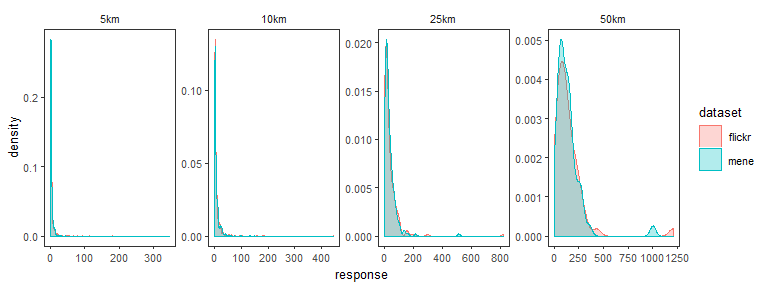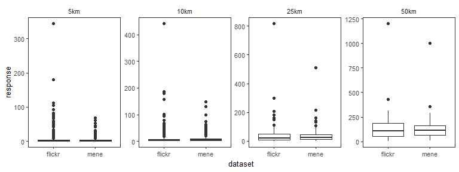

Number of non-zero cells (total is total number of cells with either a flickr or MENE observation):

| resolution |  total|  flickr|  mene|
|:-----------|------:|-------:|-----:|
| 5km        |   3100|    2047|  2254|
| 10km       |   1177|     952|  1021|
| 25km       |    208|     206|   206|
| 50km       |     53|      53|    53|

### Spatial coverage of the observations

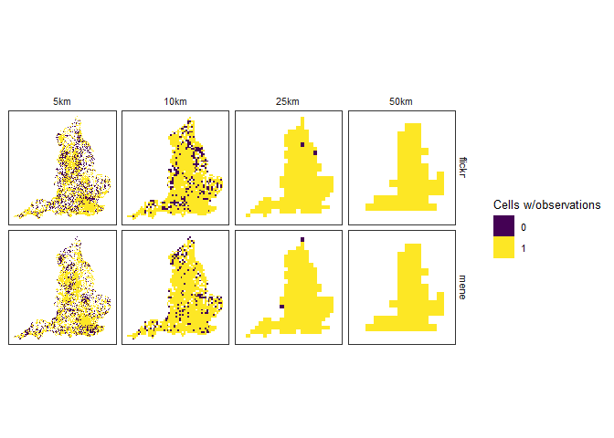

### Distribution of covariates

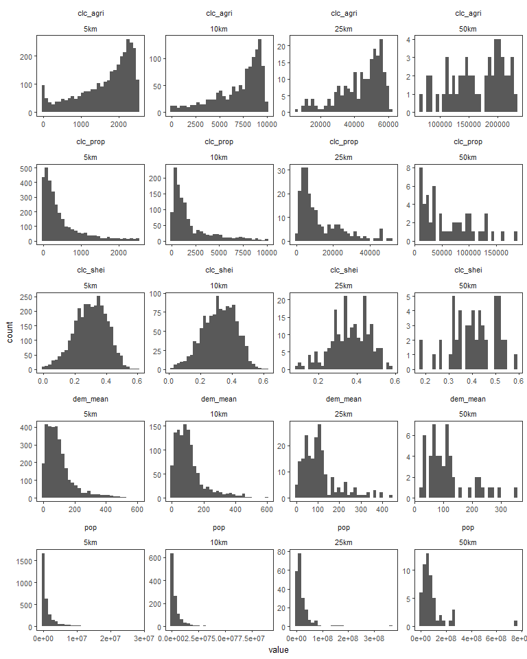

-   clc\_agri: left skew at all resolutions
-   clc\_prop: right skew at all resolutions
-   clc\_shei: fine
-   dem\_mean: right skew at all resolutions
-   pop: right skew at all resolutions

We log transform clc\_prop, dem\_mean and pop; we square transform clc\_agri.

### Correlation between variables

    ## [[1]]

    ## 
    ## [[2]]

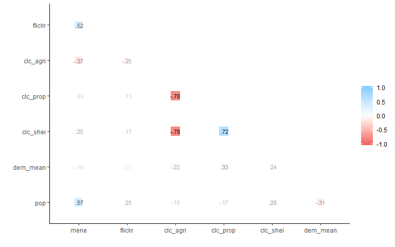

    ## 
    ## [[3]]

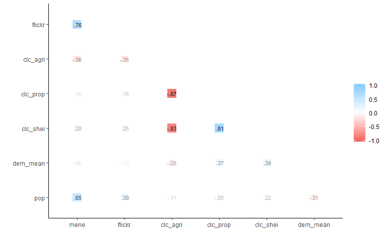

    ## 
    ## [[4]]

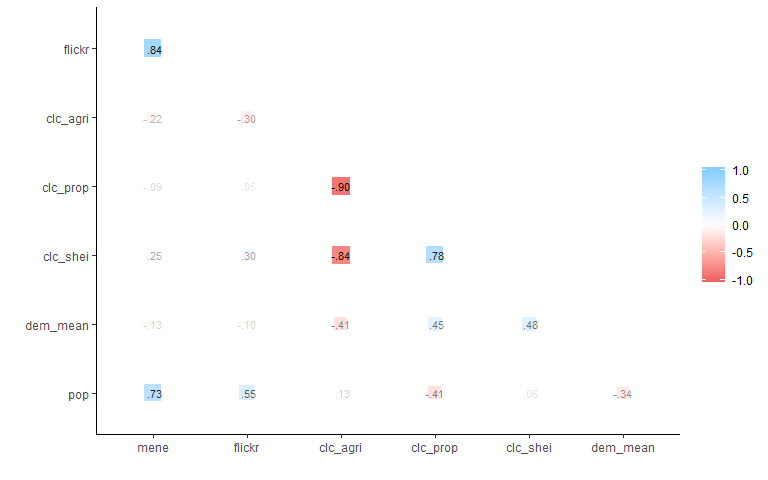

High correlation between variables along with small sample size might mean dropping the 50km resolution analysis (for now care to be taken with this analysis).

Q1: How similar are proxies for recreation at different scales?
===============================================================

Hypothesis: The MENE visits and Flickr photos are proxies for different kinds of recreation. MENE visits are day-to-day local recreation; Flickr photos represent \[tourism, aesthetic, holiday etc. - need a name for this\].

Test: MENE visits will not explain a large proportion of the variation in Flickr photos,

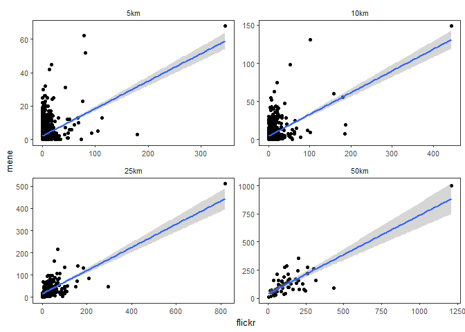

We have one rather large outlier at each resolution - remove this and test:

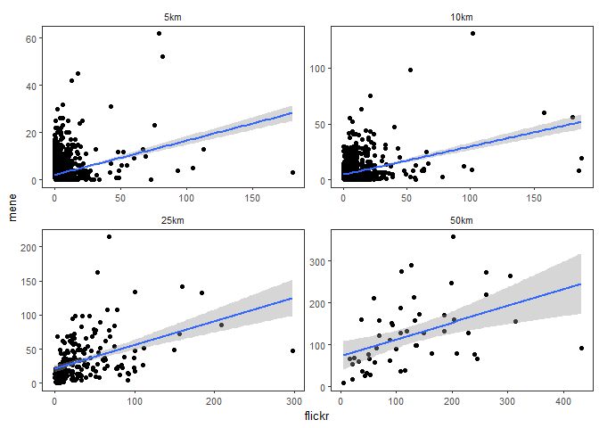

We are fitting a poisson glm for each resolution with flickr photos as response, and mene visits as covariate. We plot *D*2, coefficient estimate and spatial plot of residuals. We do this for the dataset with and without the outliers.

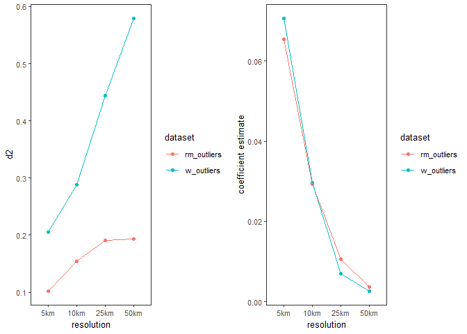

The outliers make a huge difference to the variance explained. We are currently removing the largest outlier at each resolution in subsequent analyses. NB the outlier at each resolutions is in London.

Spatial distribution of the residuals

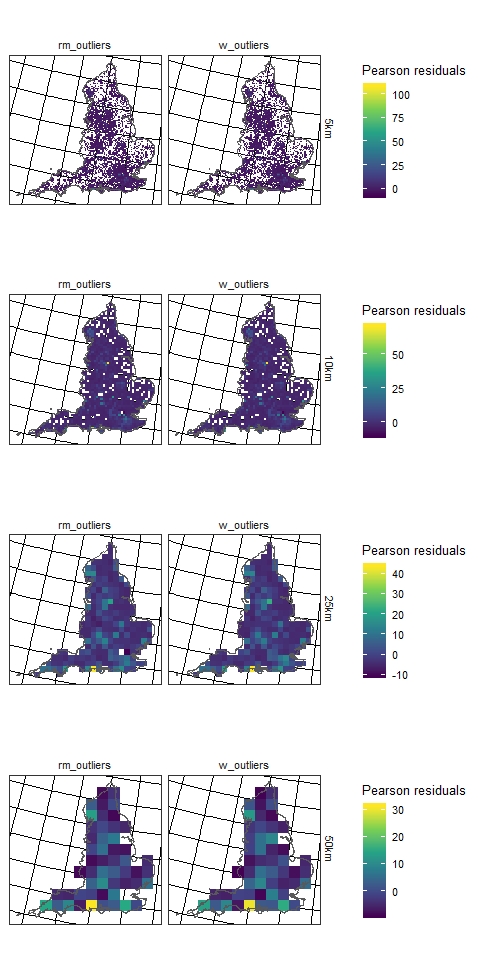

It's difficult to see, but the highest (yellow) residual in the 5km resolution plot is in the same location as that for the 10km plot (Peak District).

When the residuals are positive, the number of flickr photos is much higher than expected based on the MENE visits. The residuals are more often positive than negative, and by a bigger margin. This means that when they diverge from each other, it's because there are more flickr photos than expected. We could do a more detailed analysis, but looks like the higher positive residuals are mainly around National Parks.

Q2: What are the relative importances of drivers of supply of and demand for ecosystem services at different scales?
====================================================================================================================

Hypothesis: supply will be a more important predictor of the flickr photos, demand of the MENE visits.

Test: variance partitioning

Model selection
---------------

We fit 3 negative binomial models for each resolution and response type. The models are supply, demand and full (combined supply and demand models):

-   Proportion of agricultural land cover (clc\_agri; supply)
-   Proporiton of natural land covers (clc\_prop; supply)
-   Diversity of land-cover types (clc\_shei; supply)
-   Mean elevation (dem\_mean; supply)
-   Total population (pop; demand)

| resolution | dataset |  mod\_full\_aic|  mod\_demand\_aic|  mod\_supply\_aic|
|:-----------|:--------|---------------:|-----------------:|-----------------:|
| 5km        | mene    |      11317.2642|        11494.2874|        11947.3590|
| 10km       | mene    |       5845.3338|         5948.4183|         6327.1442|
| 25km       | mene    |       1590.2688|         1621.9768|         1735.2133|
| 50km       | mene    |        511.5077|          510.0809|          572.1268|
| 5km        | flickr  |      12507.7102|        12773.9048|        12564.3449|
| 10km       | flickr  |       6403.4654|         6601.5552|         6484.8712|
| 25km       | flickr  |       1790.1068|         1837.1691|         1807.9979|
| 50km       | flickr  |        585.0886|          586.1729|          593.8198|

In all cases except 50km resolution the full (supply & demand) model is the best performing model as judged by AIC. At 50km resolution, technically the demand model would be judged the best model in both cases; however, there is very little in it. At all resolutions, there is more support for the demand than supply model when MENE observations are used as a proxy for recreation. At all but 50km resolution, there is more support for the supply than demand model when flickr photos are used as a proxy.

### Variance partitioning

Total variance explained and how it's partitioned for the full model

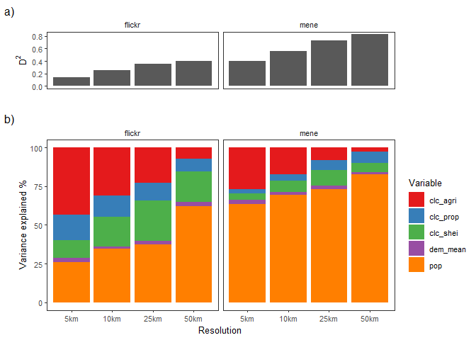

-   When using Flickr as a proxy, the supply part of the model counts for &gt; 50% of the explained variance at all resolutions except 50km
-   When using MENE visits as a proxy, the supply part of the model never accounts for more than 36% of the explained variance
-   The full model explains less variance in the flickr data than it does the MENE data
-   Scale dependencies: in both cases, the coarser the scale, the more variance is explained by demand for rather than supply of the service

### Variable relationships

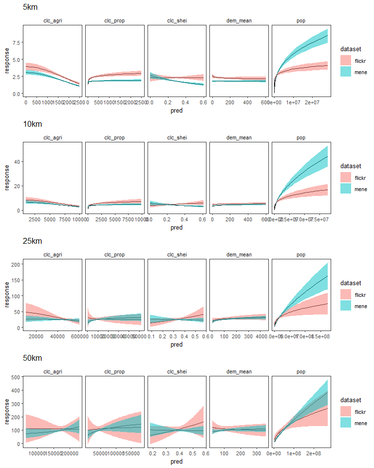

### Model checking

From below fits can see that model meets assumptions at all resolutions when using MENE as the response, but not when using flickr as the response. Despite using negative binomial, there is still overdispersion at the 5km and 10km resolutions. We are clearly missing something here.

    ## [1] 5km
    ## Levels: 5km 10km 25km 50km
    ## [1] "mene"

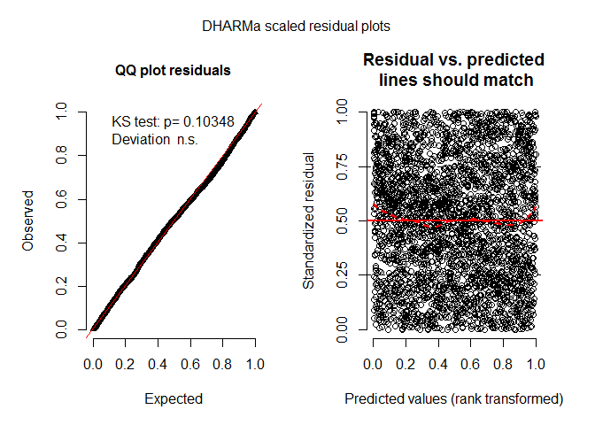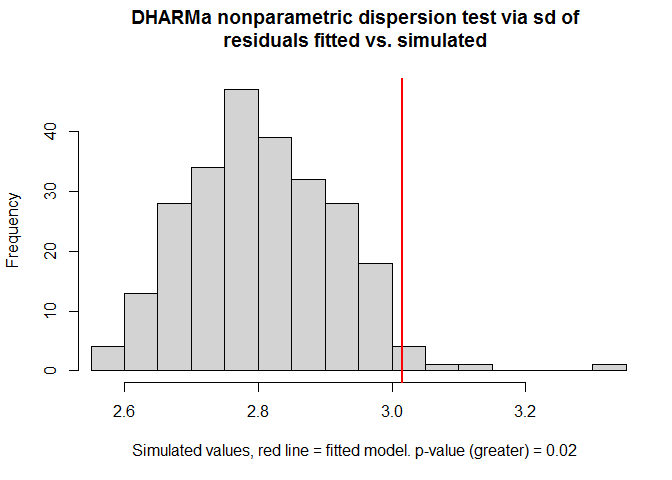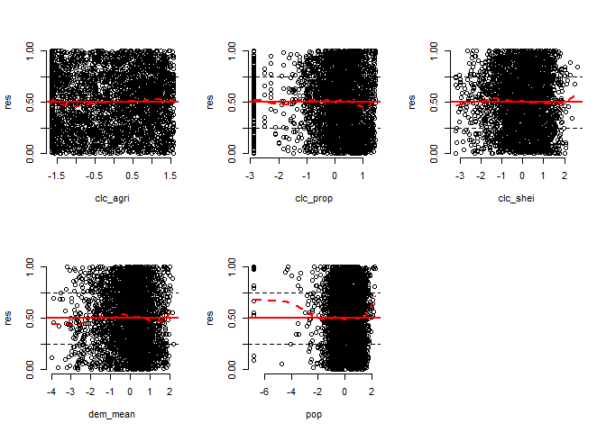

    ## [1] 10km
    ## Levels: 5km 10km 25km 50km
    ## [1] "mene"

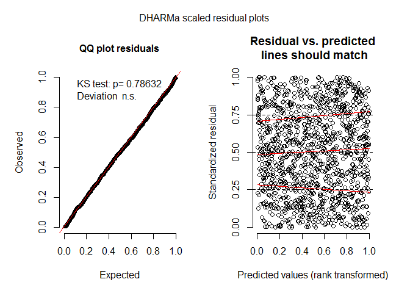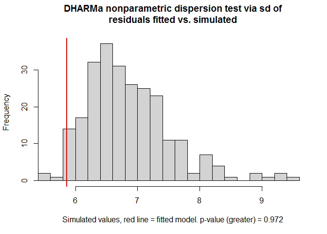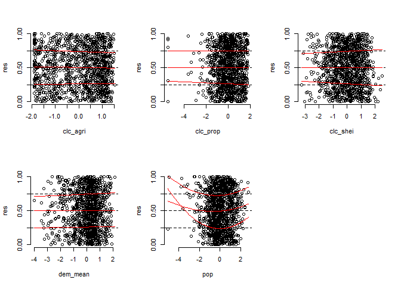

    ## [1] 25km
    ## Levels: 5km 10km 25km 50km
    ## [1] "mene"

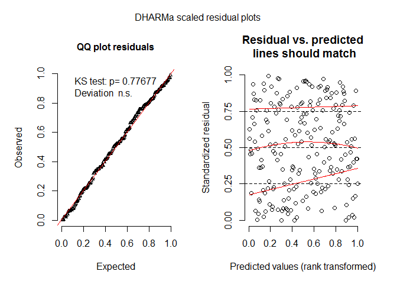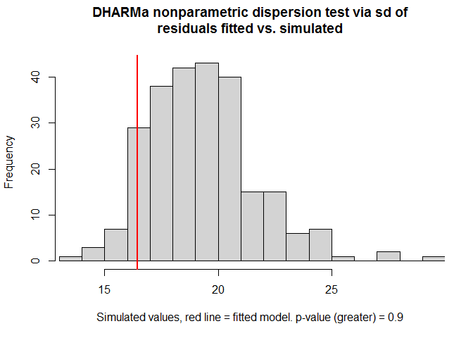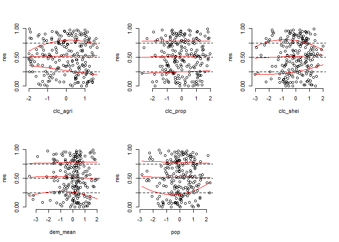

    ## [1] 50km
    ## Levels: 5km 10km 25km 50km
    ## [1] "mene"

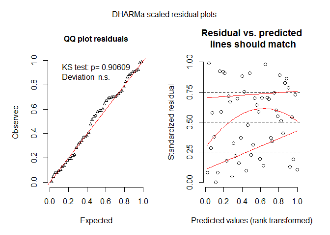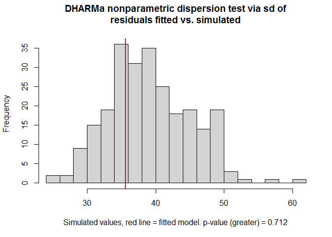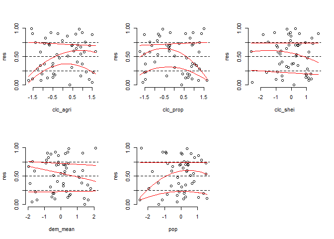

    ## [1] 5km
    ## Levels: 5km 10km 25km 50km
    ## [1] "flickr"

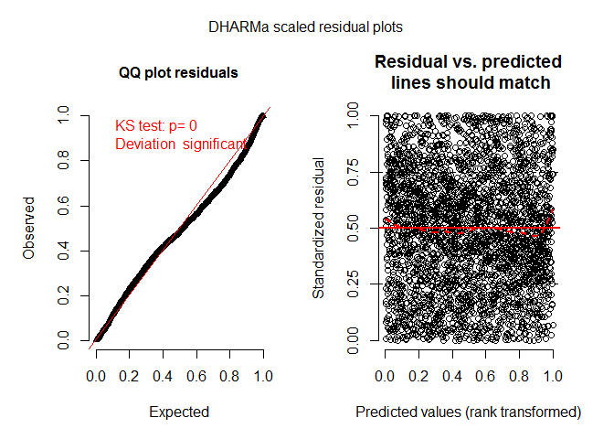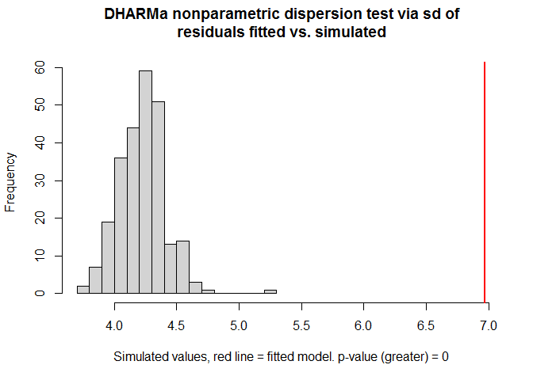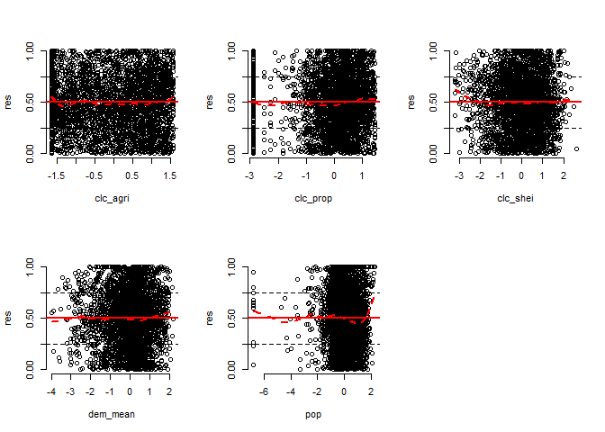

    ## [1] 10km
    ## Levels: 5km 10km 25km 50km
    ## [1] "flickr"

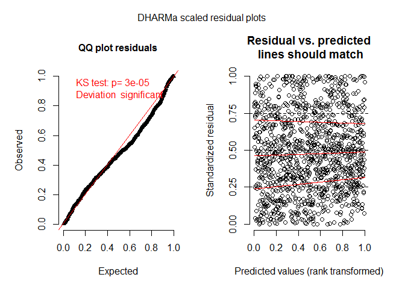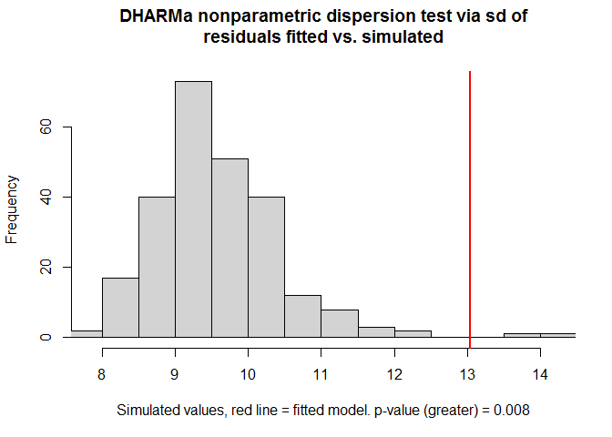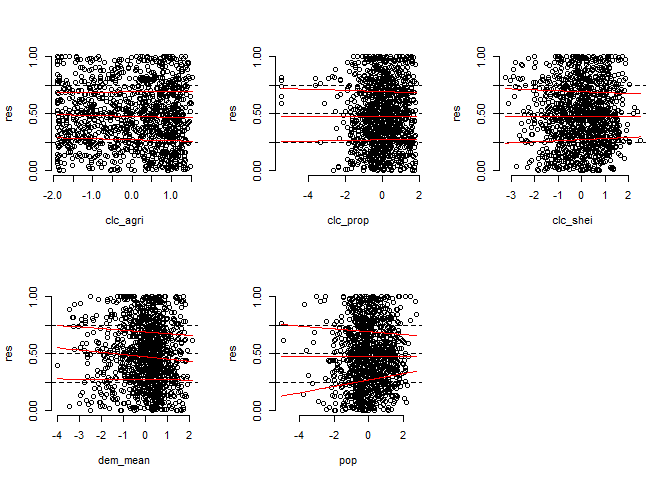

    ## [1] 25km
    ## Levels: 5km 10km 25km 50km
    ## [1] "flickr"

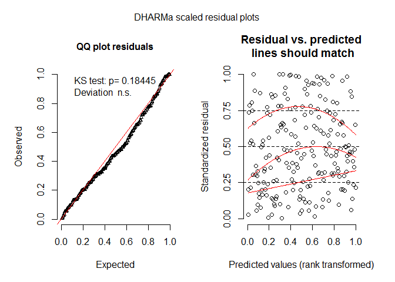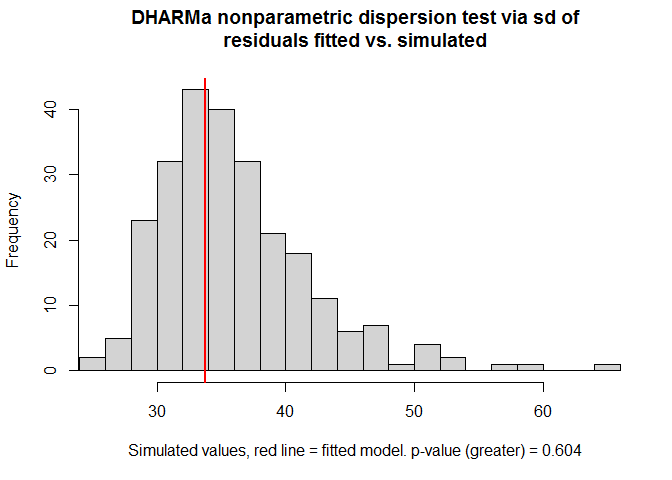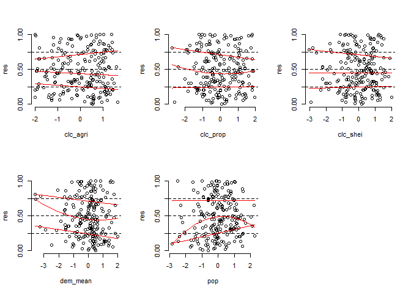

    ## [1] 50km
    ## Levels: 5km 10km 25km 50km
    ## [1] "flickr"

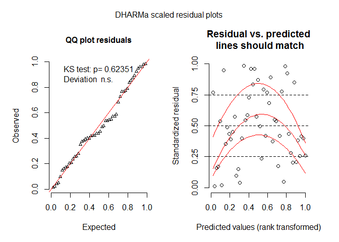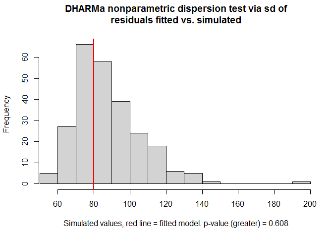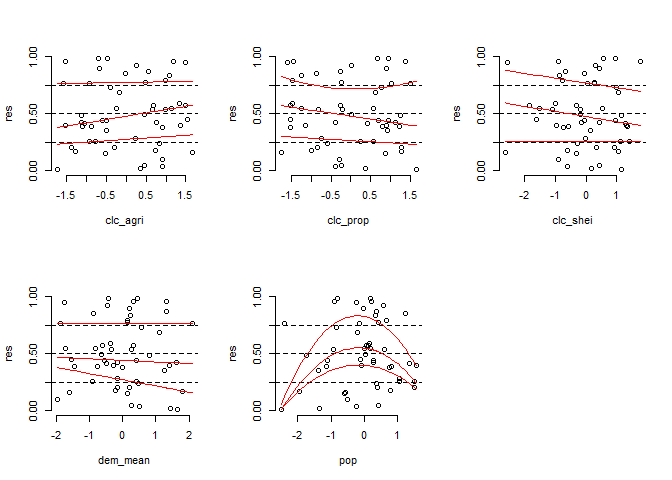

Session Info
------------

    ##  setting  value                       
    ##  version  R version 3.5.0 (2018-04-23)
    ##  system   x86_64, mingw32             
    ##  ui       RTerm                       
    ##  language (EN)                        
    ##  collate  English_United Kingdom.1252 
    ##  tz       Europe/London               
    ##  date     2018-10-03

| package      | \*  | version | date       | source                                 |
|:-------------|:----|:--------|:-----------|:---------------------------------------|
| assertthat   |     | 0.2.0   | 2017-04-11 | CRAN (R 3.5.0)                         |
| backports    |     | 1.1.2   | 2017-12-13 | CRAN (R 3.5.0)                         |
| base         | \*  | 3.5.0   | 2018-04-23 | local                                  |
| bindr        |     | 0.1.1   | 2018-03-13 | CRAN (R 3.5.0)                         |
| bindrcpp     | \*  | 0.2.2   | 2018-03-29 | CRAN (R 3.5.0)                         |
| broom        | \*  | 0.4.4   | 2018-03-29 | CRAN (R 3.5.0)                         |
| cellranger   |     | 1.1.0   | 2016-07-27 | CRAN (R 3.5.0)                         |
| class        |     | 7.3-14  | 2015-08-30 | CRAN (R 3.5.0)                         |
| classInt     |     | 0.2-3   | 2018-04-16 | CRAN (R 3.5.0)                         |
| cli          |     | 1.0.0   | 2017-11-05 | CRAN (R 3.5.0)                         |
| codetools    |     | 0.2-15  | 2016-10-05 | CRAN (R 3.5.0)                         |
| colorspace   |     | 1.3-2   | 2016-12-14 | CRAN (R 3.5.0)                         |
| compiler     |     | 3.5.0   | 2018-04-23 | local                                  |
| corrr        | \*  | 0.3.0   | 2018-07-31 | CRAN (R 3.5.1)                         |
| crayon       |     | 1.3.4   | 2017-09-16 | CRAN (R 3.5.0)                         |
| datasets     | \*  | 3.5.0   | 2018-04-23 | local                                  |
| DBI          |     | 1.0.0   | 2018-05-02 | CRAN (R 3.5.0)                         |
| devtools     |     | 1.13.5  | 2018-02-18 | CRAN (R 3.5.0)                         |
| DHARMa       | \*  | 0.2.0   | 2018-06-05 | CRAN (R 3.5.1)                         |
| digest       |     | 0.6.15  | 2018-01-28 | CRAN (R 3.5.0)                         |
| dplyr        | \*  | 0.7.6   | 2018-06-29 | CRAN (R 3.5.1)                         |
| e1071        |     | 1.6-8   | 2017-02-02 | CRAN (R 3.5.0)                         |
| evaluate     |     | 0.10.1  | 2017-06-24 | CRAN (R 3.5.0)                         |
| forcats      | \*  | 0.3.0   | 2018-02-19 | CRAN (R 3.5.0)                         |
| foreach      |     | 1.4.4   | 2017-12-12 | CRAN (R 3.5.0)                         |
| foreign      |     | 0.8-71  | 2018-07-20 | CRAN (R 3.5.1)                         |
| gap          |     | 1.1-21  | 2018-01-24 | CRAN (R 3.5.0)                         |
| GGally       | \*  | 1.4.0   | 2018-05-17 | CRAN (R 3.5.0)                         |
| ggplot2      | \*  | 3.0.0   | 2018-07-03 | CRAN (R 3.5.1)                         |
| glue         |     | 1.3.0   | 2018-07-17 | CRAN (R 3.5.1)                         |
| graphics     | \*  | 3.5.0   | 2018-04-23 | local                                  |
| grDevices    | \*  | 3.5.0   | 2018-04-23 | local                                  |
| grid         |     | 3.5.0   | 2018-04-23 | local                                  |
| gtable       |     | 0.2.0   | 2016-02-26 | CRAN (R 3.5.0)                         |
| gtools       | \*  | 3.5.0   | 2015-05-29 | CRAN (R 3.5.0)                         |
| haven        |     | 1.1.1   | 2018-01-18 | CRAN (R 3.5.0)                         |
| hier.part    | \*  | 1.0-4   | 2013-01-08 | CRAN (R 3.5.0)                         |
| highr        |     | 0.6     | 2016-05-09 | CRAN (R 3.5.0)                         |
| hms          |     | 0.4.2   | 2018-03-10 | CRAN (R 3.5.0)                         |
| htmltools    |     | 0.3.6   | 2017-04-28 | CRAN (R 3.5.0)                         |
| httr         |     | 1.3.1   | 2017-08-20 | CRAN (R 3.5.0)                         |
| iterators    |     | 1.0.9   | 2017-12-12 | CRAN (R 3.5.0)                         |
| jsonlite     |     | 1.5     | 2017-06-01 | CRAN (R 3.5.0)                         |
| jtools       | \*  | 1.0.0   | 2018-05-08 | CRAN (R 3.5.0)                         |
| knitr        | \*  | 1.20    | 2018-02-20 | CRAN (R 3.5.0)                         |
| labeling     |     | 0.3     | 2014-08-23 | CRAN (R 3.5.0)                         |
| lattice      |     | 0.20-35 | 2017-03-25 | CRAN (R 3.5.0)                         |
| lazyeval     |     | 0.2.1   | 2017-10-29 | CRAN (R 3.5.0)                         |
| lme4         |     | 1.1-17  | 2018-04-03 | CRAN (R 3.5.0)                         |
| lubridate    |     | 1.7.4   | 2018-04-11 | CRAN (R 3.5.0)                         |
| magrittr     |     | 1.5     | 2014-11-22 | CRAN (R 3.5.0)                         |
| MASS         | \*  | 7.3-49  | 2018-02-23 | CRAN (R 3.5.0)                         |
| Matrix       |     | 1.2-14  | 2018-04-13 | CRAN (R 3.5.0)                         |
| memoise      |     | 1.1.0   | 2017-04-21 | CRAN (R 3.5.0)                         |
| methods      | \*  | 3.5.0   | 2018-04-23 | local                                  |
| minqa        |     | 1.2.4   | 2014-10-09 | CRAN (R 3.5.0)                         |
| mnormt       |     | 1.5-5   | 2016-10-15 | CRAN (R 3.5.0)                         |
| modelr       |     | 0.1.2   | 2018-05-11 | CRAN (R 3.5.0)                         |
| MuMIn        | \*  | 1.40.4  | 2018-01-30 | CRAN (R 3.5.0)                         |
| munsell      |     | 0.4.3   | 2016-02-13 | CRAN (R 3.5.0)                         |
| nlme         |     | 3.1-137 | 2018-04-07 | CRAN (R 3.5.0)                         |
| nloptr       |     | 1.0.4   | 2017-08-22 | CRAN (R 3.5.0)                         |
| parallel     |     | 3.5.0   | 2018-04-23 | local                                  |
| patchwork    | \*  | 0.0.1   | 2018-07-20 | Github (<thomasp85/patchwork@7fb35b1>) |
| pillar       |     | 1.2.2   | 2018-04-26 | CRAN (R 3.5.0)                         |
| pkgconfig    |     | 2.0.1   | 2017-03-21 | CRAN (R 3.5.0)                         |
| plyr         |     | 1.8.4   | 2016-06-08 | CRAN (R 3.5.0)                         |
| pscl         | \*  | 1.5.2   | 2017-10-10 | CRAN (R 3.5.0)                         |
| psych        |     | 1.8.4   | 2018-05-06 | CRAN (R 3.5.0)                         |
| purrr        | \*  | 0.2.5   | 2018-05-29 | CRAN (R 3.5.1)                         |
| qrnn         |     | 2.0.2   | 2017-12-20 | CRAN (R 3.5.0)                         |
| R6           |     | 2.2.2   | 2017-06-17 | CRAN (R 3.5.0)                         |
| raster       | \*  | 2.6-7   | 2017-11-13 | CRAN (R 3.5.1)                         |
| RColorBrewer |     | 1.1-2   | 2014-12-07 | CRAN (R 3.5.0)                         |
| Rcpp         |     | 0.12.18 | 2018-07-23 | CRAN (R 3.5.1)                         |
| readr        | \*  | 1.1.1   | 2017-05-16 | CRAN (R 3.5.0)                         |
| readxl       |     | 1.1.0   | 2018-04-20 | CRAN (R 3.5.0)                         |
| reshape      |     | 0.8.7   | 2017-08-06 | CRAN (R 3.5.0)                         |
| reshape2     |     | 1.4.3   | 2017-12-11 | CRAN (R 3.5.0)                         |
| rlang        |     | 0.2.1   | 2018-05-30 | CRAN (R 3.5.1)                         |
| rmarkdown    |     | 1.10    | 2018-06-11 | CRAN (R 3.5.1)                         |
| rprojroot    |     | 1.3-2   | 2018-01-03 | CRAN (R 3.5.0)                         |
| rstudioapi   |     | 0.7     | 2017-09-07 | CRAN (R 3.5.0)                         |
| rvest        |     | 0.3.2   | 2016-06-17 | CRAN (R 3.5.0)                         |
| scales       |     | 0.5.0   | 2017-08-24 | CRAN (R 3.5.0)                         |
| sf           | \*  | 0.6-3   | 2018-05-17 | CRAN (R 3.5.1)                         |
| sp           | \*  | 1.2-7   | 2018-01-19 | CRAN (R 3.5.0)                         |
| spData       |     | 0.2.8.3 | 2018-03-25 | CRAN (R 3.5.0)                         |
| splines      |     | 3.5.0   | 2018-04-23 | local                                  |
| stats        | \*  | 3.5.0   | 2018-04-23 | local                                  |
| stats4       |     | 3.5.0   | 2018-04-23 | local                                  |
| stringi      |     | 1.1.7   | 2018-03-12 | CRAN (R 3.5.0)                         |
| stringr      | \*  | 1.3.1   | 2018-05-10 | CRAN (R 3.5.0)                         |
| tibble       | \*  | 1.4.2   | 2018-01-22 | CRAN (R 3.5.0)                         |
| tidyr        | \*  | 0.8.0   | 2018-01-29 | CRAN (R 3.5.0)                         |
| tidyselect   |     | 0.2.4   | 2018-02-26 | CRAN (R 3.5.0)                         |
| tidyverse    | \*  | 1.2.1   | 2017-11-14 | CRAN (R 3.5.0)                         |
| tools        |     | 3.5.0   | 2018-04-23 | local                                  |
| udunits2     |     | 0.13    | 2016-11-17 | CRAN (R 3.5.0)                         |
| units        |     | 0.5-1   | 2018-01-08 | CRAN (R 3.5.0)                         |
| utils        | \*  | 3.5.0   | 2018-04-23 | local                                  |
| viridisLite  |     | 0.3.0   | 2018-02-01 | CRAN (R 3.5.0)                         |
| withr        |     | 2.1.2   | 2018-07-20 | Github (<jimhester/withr@fe56f20>)     |
| xml2         |     | 1.2.0   | 2018-01-24 | CRAN (R 3.5.0)                         |
| yaml         |     | 2.1.19  | 2018-05-01 | CRAN (R 3.5.0)                         |
